<div align="center">

# dlss5-anywhere

**DLSS 5 Neural Rendering for any game, video or app, through Lossless Scaling.**

[English](README.md) · [Tiếng Việt](README.vi.md)

</div>

> **Version v0.0.4** · The script fills in the NR keys RHI does not create (Model C, PassCount 1, HookPoint 1), so a fresh install no longer ends up scaling without NR. Install steps reordered: NR Cost Scaler on before the add-on install, first LS launch through the script.
>
> Last tested 2026-09-07 on an RTX 5070 Ti with Lossless Scaling 3.2.2, RHI 2.6.3, ReShade 6.8.0, DLSS SR/RR/FG 310.9.0, NR DLL 310.8.2, NVIDIA driver 616.64.

The idea is simple: instead of installing the DLSS 5 Neural Rendering add-on (NR from here on) into each game, install it into **Lossless Scaling** (LS). Whatever window LS captures gets processed by NR. No game files are touched.

---

## Demo

Split images show the same frame for comparison: NR on the left, NR off on the right. Full-frame images have NR on.

**A YouTube video in the browser**

*Watch a trailer with NR on. What if you could see DLSS 5 before the game even ships?*

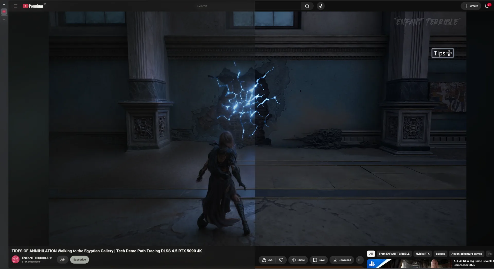

**A Wii game through Dolphin**

*An old game on an emulator. Still waiting for a remaster?*

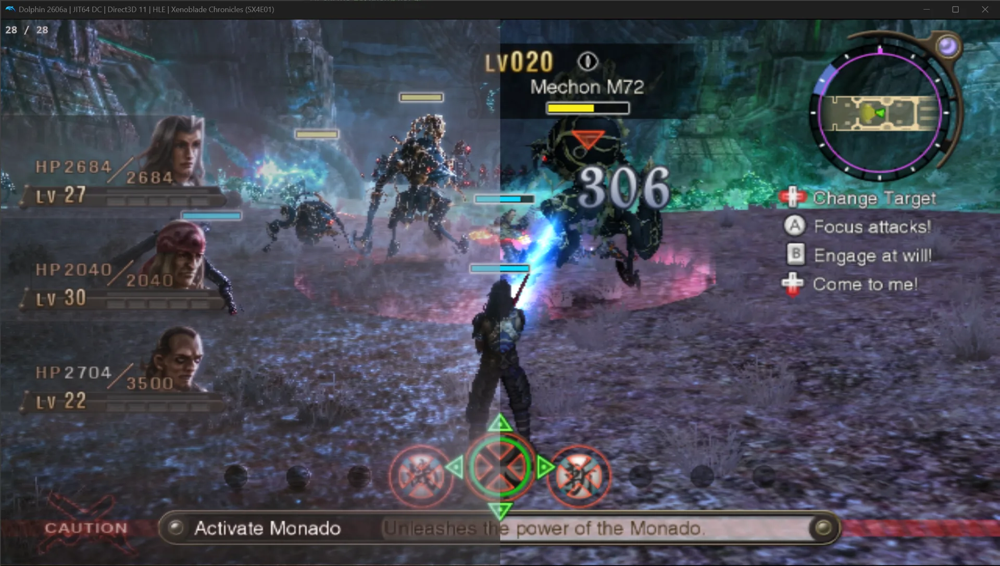

The same scene, NR on across the full frame.

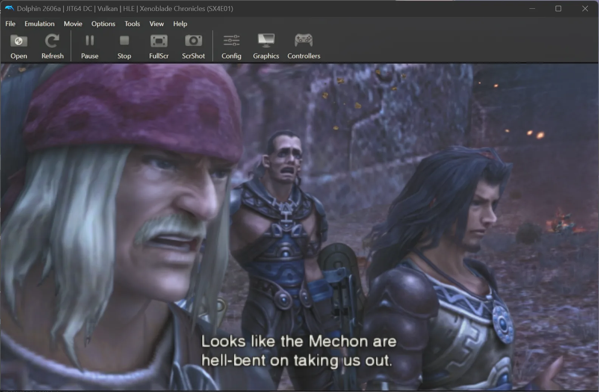

**A mobile game through Google Play Games**

*A familiar mobile title, running with the newest image tech on PC.*

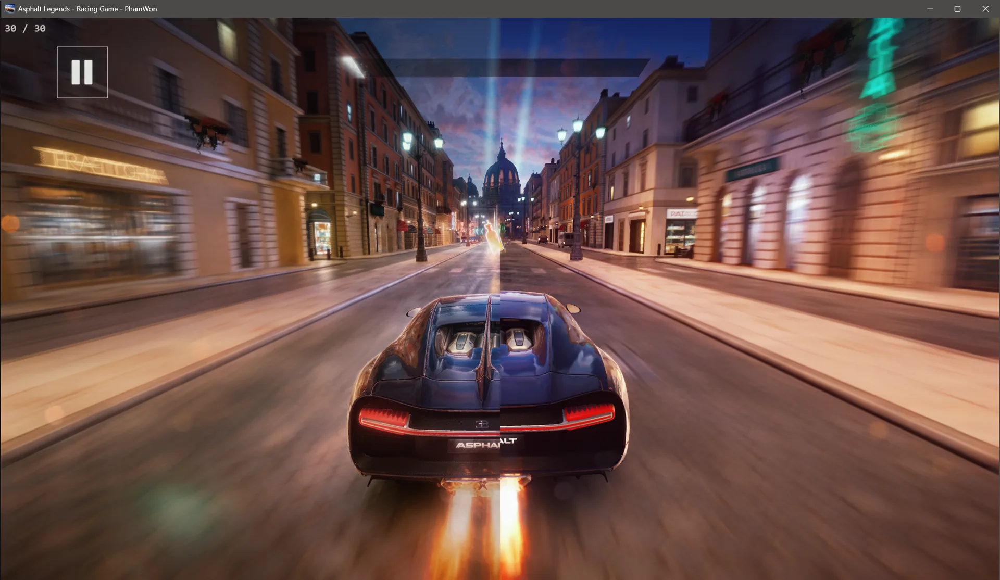

**A PC game without DLSS**

*A game that never supported DLSS. It gets NR anyway.*

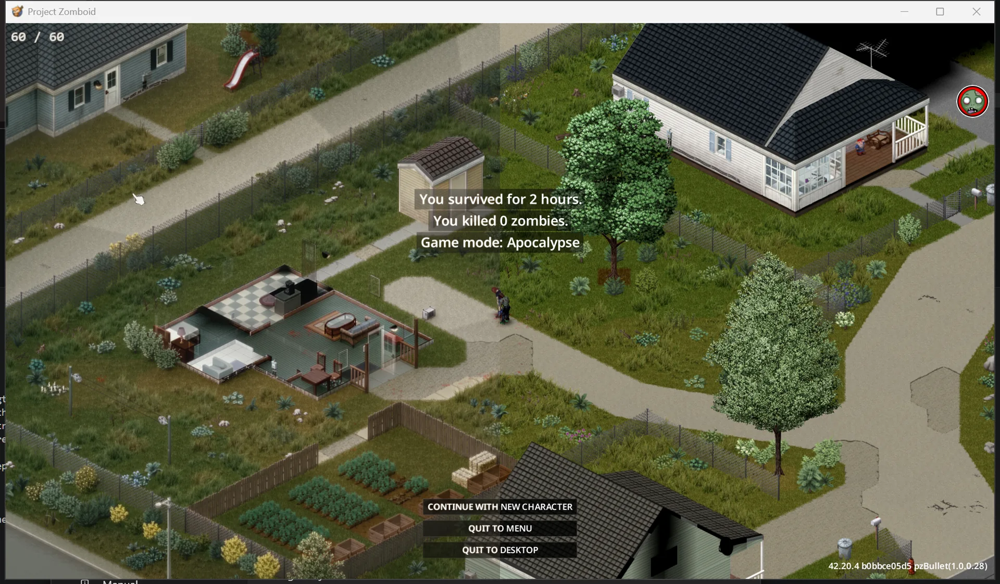

**A modern PC game at max settings**

*Already maxed out. What can NR still add?*

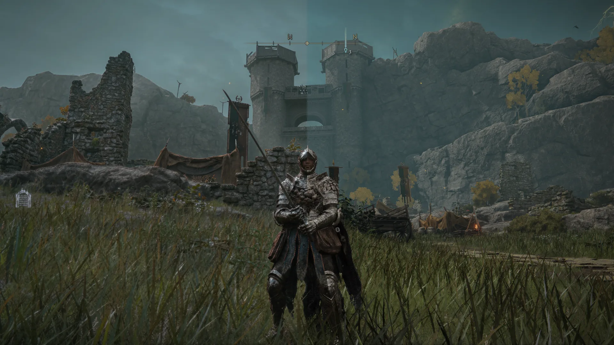

The same scene, NR on across the full frame, at 4K.

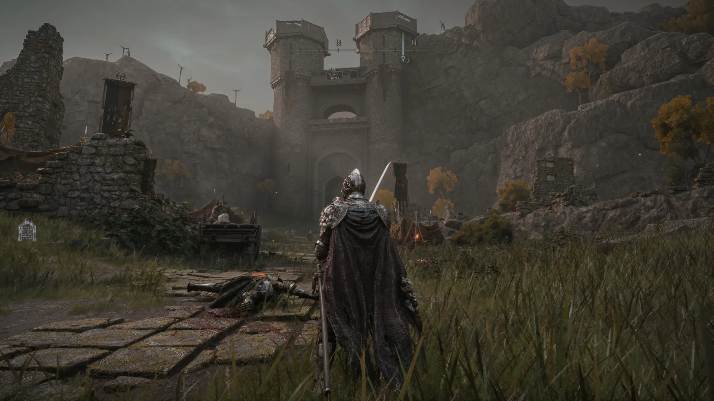

**Black Myth: Wukong, max settings, 4K**

*One of the best-looking games around. Full-frame NR.*

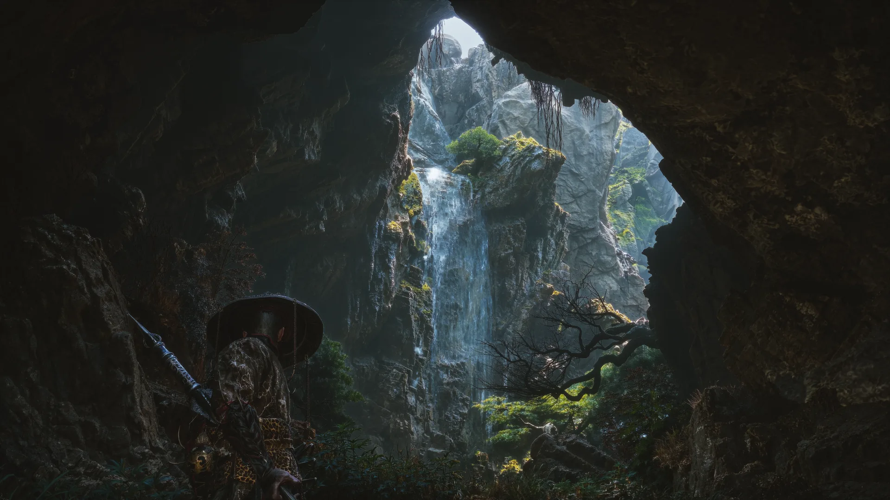

NR makes the biggest difference on low-texture sources. On images that are already sharp, the change is smaller.

---

## Install

Actions only. The reasons behind each step are in [Explained](#explained).

You need:

- **An NVIDIA RTX 20 or newer**, driver 616.64 or later ([details](#which-gpus-work))
- **[Lossless Scaling](https://store.steampowered.com/app/993090/)** from Steam
- **[RHI](https://github.com/RankFTW/RHI/releases)**

Four steps. Each ends with a **Check** line.

### 1. RHI

Open RHI, find the **Lossless Scaling** card. If it is missing, click *Browse* and point it at the LS install folder. Then, in order:

1. **Components** → *ReShade* → **Install**
2. **Neural Rendering** → *Method* → **DLSS Tool (ShortFuse)** ([about this add-on](#the-dlss-tool-shortfuse-add-on))
3. Click the gear next to **Remove** → **ShortFuse Settings** → switch *Auto-configure ReShade for FrameGen* to **Off** → **Save** ([why](#auto-configure-reshade-for-framegen))
4. Switch **NR Cost Scaler** to **On** ([why](#nr-cost-scaler)). The switch is locked once the add-on is installed: if it is already installed, **Remove** → switch on → **Reinstall**.
5. **Neural Rendering** → **Install**

Do not open LS from RHI or Steam yet. The first launch is in step 4, through the script.

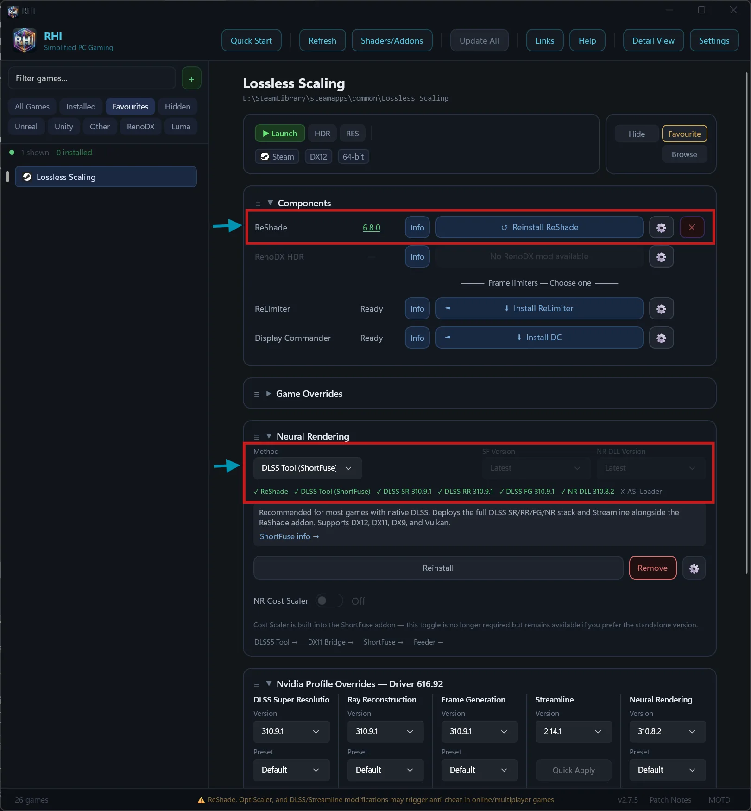

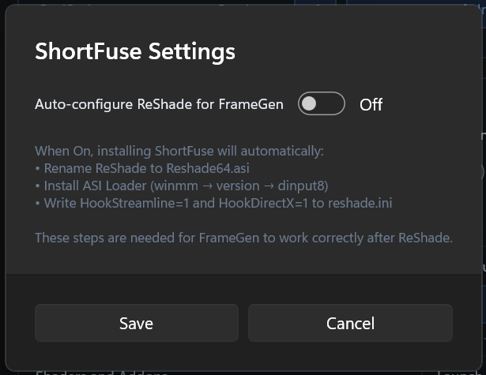

**Check:** the status row in RHI shows `✓ ReShade ✓ DLSS Tool (ShortFuse) ✓ DLSS SR ✓ DLSS RR ✓ DLSS FG ✓ NR DLL ✗ ASI Loader`, and the NR Cost Scaler row says *Installed*. The LS folder has `dxgi.dll` (ReShade), `ReShade.ini`, `renodx-dlss.addon64` and `nvngx_dlssnr.ini`.

### 2. LosslessProxy + LSP-Windowed

Two unofficial add-ons that may violate the LS terms of service ([details](#losslessproxy-and-lsp-windowed)). Download only from the two release pages below. Close LS first.

1. Download `Lossless.dll` from the [LosslessProxy releases](https://github.com/FrankBarretta/LosslessProxy/releases). In the LS folder, rename the original `Lossless.dll` to `Lossless_original.dll`, then copy the new file in.
2. Download `LSP-Windowed.zip` from the [LSP-Windowed releases](https://github.com/FrankBarretta/LSP-Windowed/releases) and extract it into `addons\LSP-Windowed\` inside the LS folder.

**Check:** the LS folder has a `LosslessProxy.log` containing `Loaded addon 'Windowed Mode'`.

### 3. Get this repo

```
git clone https://github.com/Won-Cafe/dlss5-anywhere
```

Or **Code › Download ZIP** on GitHub and extract it. Any folder works.

### 4. Run the script

Close LS. Open PowerShell in the repo folder:

```powershell
.\scripts\nr-config.ps1
```

The script asks, in order: NR on or off, **Model**, **PassCount**, **HookPoint**, **Cost Scaler** (on/off and scale), the FPS counter. Enter takes the value in brackets: the current one, or the suggested one when the key is not in `ReShade.ini` yet (RHI does not create the NR keys). Then it asks about the advanced settings, then whether to open LS.

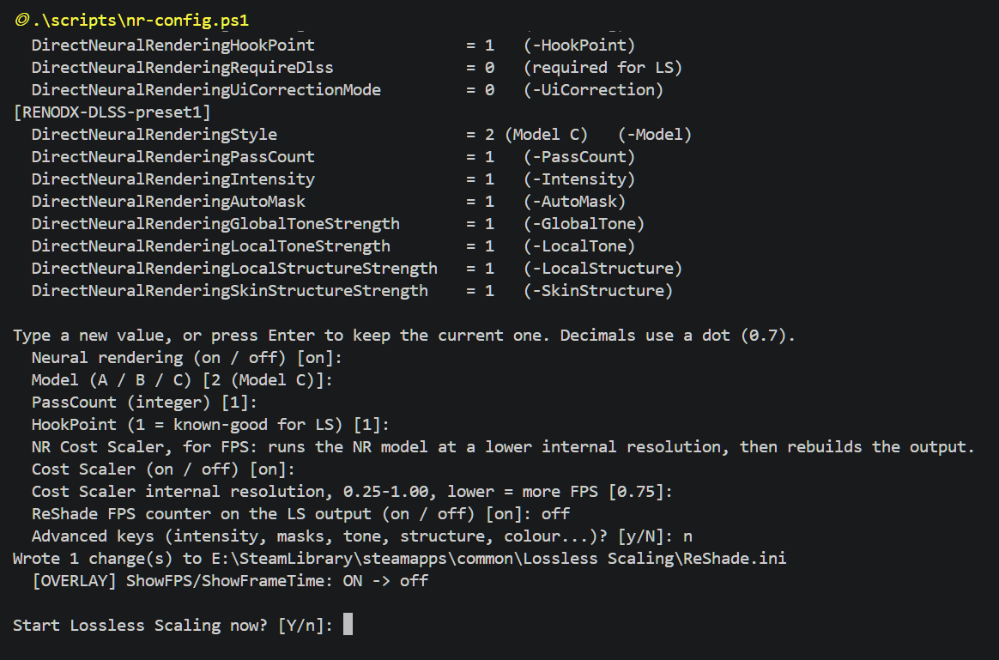

With parameters, the script asks nothing and writes directly; keys still missing get the suggested values (Model C, PassCount 1, HookPoint 1). Add `-Launch` to open LS right after.

| Parameter | What it does |
|---|---|
| `-On` / `-Off` | Turns the NR add-on on or off. |
| `-Model A\|B\|C` | Selects the NR model. |
| `-PassCount n` | Number of NR passes per frame. |
| `-HookPoint n` | Where the add-on hooks into the image pipeline. |
| `-CostScaler on\|off` | Turns NR Cost Scaler on or off. |
| `-CostScale x` | Cost Scaler internal resolution scale, 0.25 to 1.00. |
| `-Intensity x` | NR effect strength. |
| `-AutoMask 0\|1` | Turns the automatic mask on or off. |
| `-GlobalTone x` `-LocalTone x` | Global and local tone strength. |
| `-LocalStructure x` `-SkinStructure x` | Surface and skin structure strength. |
| `-UiCorrection` `-Encoding` `-WhiteNits` `-WhiteOverride` | HDR and UI settings. |
| `-Fps on\|off` | Shows or hides ReShade's FPS and frame-time counter. |
| `-Ota on\|off` | Turns the NVIDIA driver's online DLSS model check (NGX OTA) on or off, machine-wide. Asks for admin. LS can stay open. |
| `-Show` | Prints the current config without writing. |
| `-Launch` | Opens LS with WPF hardware acceleration off while LS runs. |
| `-LsPath "…"` | Path to the LS folder, when the script cannot find it. |

**Check:** `.\scripts\nr-config.ps1 -Show` prints no `(missing)` on the Style, PassCount and HookPoint rows. LS opens, not scaling yet, GPU usage in Task Manager near zero. Click **Scale** (`Ctrl+Alt+S`) and the picture changes. `ReShade.log` has the line `DLSS-NR direct: attached snippet …\nvngx_dlssnr.dll`.

<details>
<summary>Without RHI</summary>

1. Install [ReShade](https://reshade.me), the **with full add-on support** build, into `LosslessScaling.exe`, API **Direct3D 10/11/12**, every effect package unticked.
2. Copy `renodx-dlss.addon64` and the `nvngx_dlssnr.dll` for your GPU generation (from the [RenoDX Discord channel](https://discord.com/channels/1408098019194310818/1543975158937821315)) into the LS folder. Keep only one `renodx-dlss*.addon64`.
3. Continue with steps 2, 3 and 4. Do not open LS before step 4.

</details>

---

## Usage

- **Open LS:** `.\scripts\nr-config.ps1 -Launch` ([why not from Steam](#the-disablehwacceleration-key)). For one click, make a shortcut with target `powershell -ExecutionPolicy Bypass -File "<repo folder>\scripts\nr-config.ps1" -Launch`.
- **Compare before and after:** toggle Scale on and off. Or `-Off -Launch`, then `-On -Launch`.
- **Tune:** close LS, run the script, reopen LS. Start with Model C, Intensity 0.6–0.7. For more FPS: Cost Scaler on, lower `-CostScale`.
- **Cost Scaler hotkeys** while scaling: `Ctrl+Alt+Space` toggles it, `Ctrl+Alt+PgUp` / `Ctrl+Alt+PgDn` raise or lower the scale, `Ctrl+Alt+End` switches the reconstruction mode.
- **Update:** RHI → **Reinstall** on any row with a new version, then run the script again.
- **Remove:** RHI → switch **NR Cost Scaler** off → red **Remove** on the Neural Rendering row → red **✕** on the ReShade row. In the LS folder: delete the proxy `Lossless.dll`, rename `Lossless_original.dll` back to `Lossless.dll`, delete the `addons\LSP-Windowed` folder.

**LS settings**

This configuration worked well in testing. Open LS, pick the profile you use, match the screenshot.

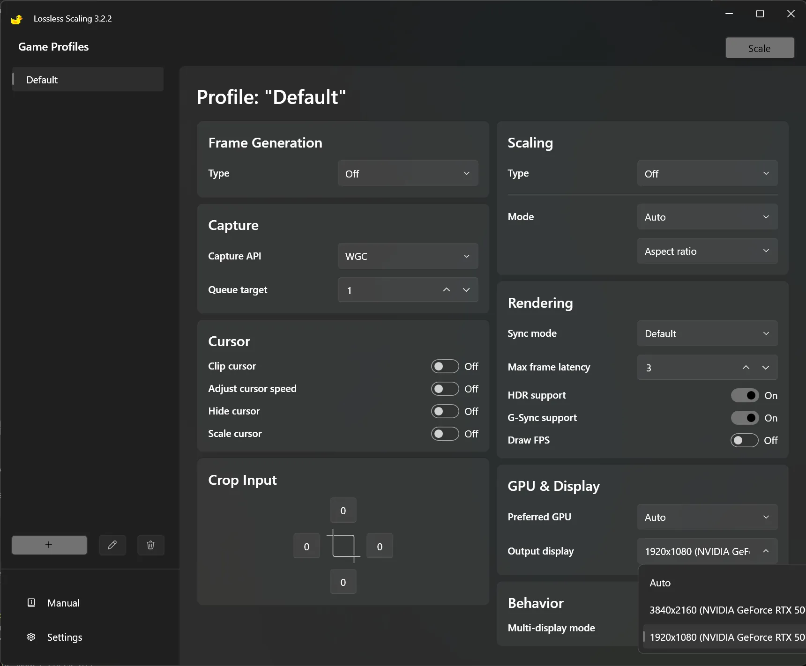

| Section | Setting |
|---|---|
| Frame Generation | LSFG 3.1, Mode **Adaptive**, Target **60**, Flow scale at max, Performance off ([limits](#ls-frame-generation)) |
| Scaling | Type **FSR**, Mode **Auto**, Sharpness in the middle, Optimized version off |
| Capture | Capture API **WGC**, Queue target **1** |
| Rendering | Sync mode **Off (Allow tearing)**, Max frame latency **3**, HDR support on |
| GPU & Display | Preferred GPU **Auto**; with several GPUs, pick the NVIDIA one directly. Output display: the monitor and resolution you want to output to |

---

## Troubleshooting

| Symptom | What to do |
|---|---|
| You press `Ctrl+Alt+S` and nothing changes | Wait a moment. ReShade and the NR add-on need time to start after the first scale. If the wait is a minute or more, run `-Ota off`. |
| Scale works, but the picture only gets the plain LS upscale, no NR, even after minutes | The NR keys are not set. Run `.\scripts\nr-config.ps1 -Show`: Style, PassCount and HookPoint must not read `(missing)`. Run the script once without parameters and press Enter through it to take the suggested values. `-Fps on` shows whether ReShade draws at all. |
| LS crashes right after opening, or ReShade processes the LS settings window | LS was opened from Steam or RHI, without the script. Check with `reg query "HKCU\SOFTWARE\Microsoft\Avalon.Graphics"`; it should show `DisableHWAcceleration 0x1`. Close LS, reopen with `.\scripts\nr-config.ps1 -Launch`. |
| Windows Defender reports a threat in `RHI\downloads\…\shaders_DLSS5Feeder.zip` | That is the DLSS5 Feeder package RHI downloads on its own. This setup does not use it, so nothing here is affected. Whether the detection is right is a question for RHI. |
| PowerShell says `running scripts is disabled on this system` or `not digitally signed` | Run it as `powershell -ExecutionPolicy Bypass -File .\scripts\nr-config.ps1`. If you downloaded the repo as a ZIP: right-click `nr-config.ps1` → Properties → tick **Unblock**. |
| FPS drops | Turn NR Cost Scaler on and lower its scale, for example `-CostScale 0.67`. Check that Frame Generation and Scaling in LS are on as in the LS settings table. Still low: lower the output resolution. |

Still stuck? Open an issue with `ReShade.log`, your GPU and driver, your LS version, and the **Copy Report** output from RHI.

---

## Explained

### How it works

- LS captures everything on screen and controls the swapchain, the last step before the image reaches the display. Putting the add-on there is enough to apply NR to any source.
- When NR is built into a game, the model receives color, motion vectors and depth. In LS there is only color, so the add-on runs in *Present* mode: once per presented frame. Slow scenes look great; fast motion tends to flicker.
- NR runs at the **output** resolution, on **every presented frame**. The higher the output resolution, the heavier NR gets.

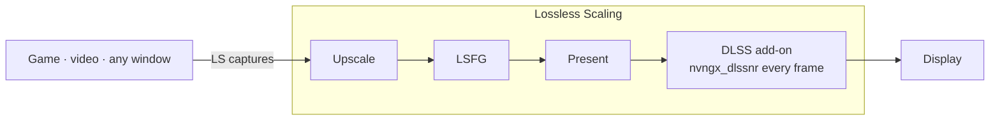

### Why each step

#### Which GPUs work

RTX 50 is officially supported by NVIDIA. RTX 20–40 run on a community-patched NR runtime, and a new driver can break it. AMD cards: the community has it working; this repo has not tried it. The repo ships no DLL files; RHI downloads them from their original sources.

#### The DLSS Tool (ShortFuse) add-on

This is ShortFuse's `renodx-dlss` ReShade add-on, distributed through the [RenoDX Discord channel](https://discord.com/channels/1408098019194310818/1543975158937821315) rather than GitHub, and it changes often. RHI downloads it and installs it together with ReShade and the NR runtime. RHI does not create the add-on's NR keys in ReShade.ini, and without `DirectNeuralRenderingHookPoint` the add-on has nothing to hook, so LS scales without NR. The script in step 4 writes `DirectNeuralRenderingRequireDlss=0`, so the add-on agrees to run in a host without DLSS such as LS, and fills in Style, PassCount and HookPoint when they are missing.

#### Auto-configure ReShade for FrameGen

This option is for games with DLSS Frame Generation: when on, RHI renames ReShade to `ReShade64.asi` and installs an ASI Loader into the LS folder. LS has no DLSS Frame Generation, so it is not needed, and one more loading layer is one more thing that can break.

#### NR Cost Scaler

[DLSSNR-Cost-Scaler](https://github.com/xenmods/DLSSNR-Cost-Scaler) by xenmods is a proxy DLL between the add-on and the NR runtime. It runs the NR model at a lower internal resolution, then uses the original frame as the anchor and transfers the neural detail onto it. FPS goes up substantially without the softness of a plain upscale. Its settings live in `nvngx_dlssnr.ini`; the script changes them through `-CostScaler` and `-CostScale`.

#### LosslessProxy and LSP-Windowed

Stock LS only captures fullscreen games. FrankBarretta's two add-ons replace `Lossless.dll` with a proxy and add a windowed mode, which lets LS capture browsers, windowed games and emulators. Both are unofficial; the author notes they may violate the LS terms of service. Without them, the YouTube, Dolphin and Google Play demos above do not work.

#### The DisableHWAcceleration key

The LS interface is built with WPF, which draws through D3D. Unless WPF hardware acceleration is off, NR processes the LS settings window too, and the GPU is busy before you even scale. Windows has no per-app switch for this, so the script sets `HKCU\SOFTWARE\Microsoft\Avalon.Graphics\DisableHWAcceleration` while LS runs and restores it when LS closes. It leaves a marker next to the key; if a previous run never got to restore it, the next launch cleans up from that marker. Opening LS from Steam or RHI works, but skips this step.

#### LS Frame Generation

NR runs on every frame LS outputs, generated ones included, not on the game's frames. Frame Generation therefore multiplies the NR work by the same factor, and the NR cost per Present sets a ceiling on the output FPS that Frame Generation cannot raise. It still helps a little, which is why the LS settings table keeps it on.

### Limitations

- No motion vectors or depth, so the image can flicker or shimmer during fast motion.
- Cost scales with output resolution. NVIDIA says the native RTX 50 integration costs 50–60 % of FPS.
- Everything on screen gets processed, including the HUD, subtitles and UI.
- Single-player only. With anti-cheat games, the game's rules apply; RHI warns about this at the bottom of its window too.
- The add-on and runtime are community builds, distributed outside GitHub, and change often.

### Legal

- This repo contains documentation and a script only. It does not distribute DLLs from NVIDIA, ReShade, the add-on, or any Lossless Scaling files.
- DLSS, GeForce and RTX are trademarks of NVIDIA. Lossless Scaling belongs to THS. ReShade belongs to crosire. RenoDX belongs to ShortFuse. RHI belongs to RankFTW. DLSSNR-Cost-Scaler belongs to xenmods. LosslessProxy and LSP-Windowed belong to FrankBarretta, who notes they may violate the LS terms of service. None of these parties are affiliated with or endorse this repo.
- Use at your own risk. No warranty. Code is under the MIT license, see [LICENSE](LICENSE).

---

## Credits

This repo stands on other people's work. If you are going to star something, star them first.

- [ReShade](https://github.com/crosire/reshade?ref=dlss5-anywhere) · crosire
- [RenoDX](https://github.com/clshortfuse/renodx?ref=dlss5-anywhere) · ShortFuse, the [`renodx-dlss`](https://discord.com/channels/1408098019194310818/1543975158937821315) add-on
- [RHI](https://github.com/RankFTW/RHI?ref=dlss5-anywhere) · RankFTW
- [DLSSNR-Cost-Scaler](https://github.com/xenmods/DLSSNR-Cost-Scaler?ref=dlss5-anywhere) · xenmods
- [LosslessProxy](https://github.com/FrankBarretta/LosslessProxy?ref=dlss5-anywhere) and [LSP-Windowed](https://github.com/FrankBarretta/LSP-Windowed?ref=dlss5-anywhere) · FrankBarretta
- [Lossless Scaling](https://store.steampowered.com/app/993090/?ref=dlss5-anywhere) · THS, on Steam
- [speedlemur](https://github.com/speedlemur?ref=dlss5-anywhere) (first working DLSS 5 NR build) · lecram, Krish · NVIDIA · and the [RenoDX Discord](https://discord.com/channels/1408098019194310818/1543975158937821315), where most of this was figured out in the open

---

## My other project

**[W.O.N](https://github.com/Won-Cafe/W.O.N)** · The Way of Intentional Flow

You know what you want, yet the gap between intention and reality stays open. W.O.N splits the problem into three pillars: **What** is the reality you stand in, **Own** is what belongs to you, **Need** is the means you require. Then it keeps the flow between the three moving, with a crew of AI helpers, each with its own trade, walking alongside you.

Those same helpers built dlss5-anywhere with me, from digging through documentation and writing the script to composing this page.
