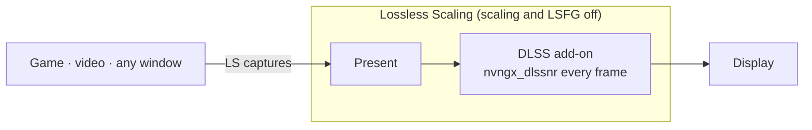

<div align="center">

# dlss5-anywhere

**DLSS 5 Neural Rendering for any game, video or app, through Lossless Scaling.**

[English](README.md) · [Tiếng Việt](README.vi.md)

</div>

> **Version v0.0.7** · Fixes NR not starting with the add-on RHI installs now ([#1](https://github.com/Won-Cafe/dlss5-anywhere/issues/1)). Newer add-on builds renamed the key that hooks LS, and the new key defaults to Off. Already set up? Close LS and **run the script once** (plain `-Launch` counts): it writes the new keys and removes the old ones. `-GlobalTone` is gone because the add-on dropped that setting.
>
> Last tested 2026-09-24 on an RTX 5070 Ti with Lossless Scaling 3.2.2, RHI 2.7.5, ReShade 6.8.0, add-on v0.2026.922.310, NR DLL 310.8.2, NVIDIA driver 616.92.

Install the DLSS 5 Neural Rendering add-on (NR) once, into **Lossless Scaling** (LS), instead of into each game. Whatever LS captures gets NR. Game files are not touched.

---

## Demo

Split images: NR on the left, off on the right. Full-frame images: NR on.

**A YouTube trailer in the browser.** See DLSS 5 before the game ships.


**A Wii game through Dolphin.** Still waiting for a remaster?


**A mobile game through Google Play Games.**


**A PC game that never had DLSS.**


**Elden Ring at max settings**, then full-frame at 4K.


**Black Myth: Wukong, max settings, 4K, full-frame.**


NR helps most on low-texture sources. On images that are already sharp the change is smaller.

---

## Install

You need an **NVIDIA RTX 20 or newer** with driver 616.64 or later ([details](#which-gpus-work)), **[Lossless Scaling](https://store.steampowered.com/app/993090/)** from Steam, and **[RHI](https://github.com/RankFTW/RHI/releases)**, which installs ReShade and the DLSS files for you.

There are four steps, each ending with a **Check**, and step 2 is optional. The reasons behind each step are in [Explained](#explained).

### 1. RHI

Open RHI and find the **Lossless Scaling** card. If it is missing, use *Browse* to add the LS folder. Then, in order:

1. **Components** → *ReShade* → **Install**
2. **Neural Rendering** → *Method* → **DLSS Tool (ShortFuse)**. Leave *SF Version* and *NR DLL Version* on **Latest** and *NR Cost Scaler* **Off** ([why](#nr-cost-scaler)).
3. Gear next to **Remove** → **ShortFuse Settings** → *Auto-configure ReShade for FrameGen* **Off** → **Save** ([why](#auto-configure-reshade-for-framegen))
4. **Neural Rendering** → **Install**

Do not open LS yet. The script starts it in step 4.


**Check:** RHI shows `✓ ReShade ✓ DLSS Tool (ShortFuse) ✓ DLSS SR ✓ DLSS RR ✓ DLSS FG ✓ NR DLL ✗ ASI Loader`. The LS folder has `dxgi.dll`, `ReShade.ini`, `renodx-dlss.addon64` and `nvngx_dlssnr.dll`.

### 2. LosslessProxy + LSP-Windowed (for windows only)

Skip this step for fullscreen games, which LS captures on its own. These two unofficial add-ons let LS capture a *window*: browsers, emulators, mobile-game players and windowed games ([details](#losslessproxy-and-lsp-windowed)). Close LS first.

1. [LosslessProxy](https://github.com/FrankBarretta/LosslessProxy/releases): in the LS folder, rename `Lossless.dll` to `Lossless_original.dll`, then copy the downloaded `Lossless.dll` in.
2. [LSP-Windowed](https://github.com/FrankBarretta/LSP-Windowed/releases): extract `LSP-Windowed.zip` into `addons\LSP-Windowed\` in the LS folder.

**Check:** `LosslessProxy.log` in the LS folder contains `Loaded addon 'Windowed Mode'`.

### 3. Get this repo

`git clone https://github.com/Won-Cafe/dlss5-anywhere`, or **Code › Download ZIP** and extract it anywhere.

### 4. Run the script

Open PowerShell in the repo folder (in Explorer: right-click the folder → *Open in Terminal*) and run:

```powershell
.\scripts\nr-config.ps1
```


The script shows the current setup, asks a few questions, writes `ReShade.ini`, and offers to start LS. Press Enter to keep the value in brackets. The keys LS always needs are written without asking.

Given parameters, it asks nothing. Add `-Launch` to start LS afterwards.

| Parameter | What it does |
|---|---|
| `-On` / `-Off` | Turn the NR add-on on or off. |
| `-Model Default\|Natural\|Cinematic` | NR style. A, B and C still work. |
| `-PassCount n` | NR passes per frame, 1 to 10. |
| `-Scale n` | Resolution the model runs at, as a percent of the frame. Lower is faster; 100 = original. This is the FPS dial. |
| `-Intensity x` | Effect strength, 0 to 1. |
| `-AutoMask 0\|1` | Character mask off or on. |
| `-LocalTone x` `-LocalStructure x` `-SkinStructure x` | Tone and detail strength, 0 to 1. |
| `-UiCorrection` `-Encoding` `-WhiteNits` `-WhiteOverride` | HDR and UI keys. 0 = auto. |
| `-Fps on\|off` | ReShade's FPS counter. |
| `-Ota on\|off` | The driver's online model check, for the whole machine. Asks for admin. |
| `-Show` | Print the current setup and write nothing. |
| `-Launch` | Start LS with WPF hardware acceleration off. |
| `-LsPath "…"` | The LS folder, if the script cannot find it. |

**Check:** `-Show` prints no warning, no `(missing)` and no `<- LS needs`. LS opens without scaling and GPU usage stays near zero. Press **Scale** (`Ctrl+Alt+S`): the picture changes, and `ReShade.log` contains `DLSS-NR direct: attached snippet`.

<details>
<summary>Without RHI</summary>

1. Install the **with full add-on support** build of [ReShade](https://reshade.me) into `LosslessScaling.exe`, with API **Direct3D 10/11/12** and no effect packages.
2. Copy `renodx-dlss.addon64` and the `nvngx_dlssnr.dll` for your GPU generation from the [RenoDX Discord](https://discord.com/channels/1408098019194310818/1543975158937821315) into the LS folder. Keep only one `renodx-dlss*.addon64`.
3. Continue with steps 2, 3 and 4.

</details>

---

## Usage

- **Start LS** with `.\scripts\nr-config.ps1 -Launch`, not from Steam ([why](#the-disablehwacceleration-key)). One-click shortcut target: `powershell -ExecutionPolicy Bypass -File "<repo>\scripts\nr-config.ps1" -Launch`.
- **Compare before and after:** toggle Scale, or run `-Off -Launch` and then `-On -Launch`.
- **Tune:** close LS, run the script, start LS again. A good start is Cinematic, 1 pass, Intensity 0.6–0.7, Scale 75.
- **Update:** in RHI, **Reinstall** each row that has a new version. Then run the script once, since new add-on builds can rename keys.
- **Remove:** in RHI, **Remove** on Neural Rendering, then **✕** on ReShade. In the LS folder, delete the proxy `Lossless.dll`, rename `Lossless_original.dll` back, and delete `addons\LSP-Windowed`.

**LS settings.** Pick your profile in LS and match the screenshot.


| Section | Setting |
|---|---|
| Frame Generation | Type **Off** ([why](#ls-frame-generation)) |
| Scaling | Type **Off**, so LS only captures and presents. Turn it on only if you also want LS to upscale. |
| Capture | API **WGC**, Queue target **1** |
| Rendering | Sync mode **Default**, Max frame latency **3**, HDR support on, G-Sync on, Draw FPS off |
| GPU & Display | Preferred GPU **Auto**, or the NVIDIA card if you have several. Output display: the monitor you play on |

---

## Known issues

- **LS can freeze the whole screen when scaling stops.** Unscaling, or LS stopping because the game lost focus, destroys LS's swapchain while the add-on is still using it. This can close LS or cause a GPU fault that needs a hard reset. The bug is in the add-on and has been reported. To avoid it, scale once per session, keep the game in front, and quit the game before closing LS.
- **NR costs time on every output frame.** Two passes cost twice as much, and 4K costs about four times 1080p: about 20 ms per pass at 4K on an RTX 5070 Ti. `-Scale` brings that down.
- **The first Scale can take a minute** while the driver asks NVIDIA's servers for models. Fix: `-Ota off`.
- **RHI actions can undo the setup.** *Auto-configure ReShade for FrameGen* can switch back on, and a new add-on build can rename keys. After any RHI action, run the script again.

---

## Troubleshooting

| Symptom | What to do |
|---|---|
| `Ctrl+Alt+S` and nothing changes | Wait a few seconds after the first scale. If it takes a minute or more: `-Ota off`. |
| Scaling works, no NR | Close LS and run the script (Enter through it), then `-Show`. `ReShade.log` must start with *loaded from … dxgi.dll* and contain `DLSS-NR direct: attached snippet` once you scale. `-Fps on` shows whether ReShade draws at all. |
| `ReShade.log` warns *sl.interposer.dll not loaded* or *hooks not ready* | Harmless in LS. These are the add-on's Streamline path, which LS does not use. |
| `ReShade.log` line 1 says *Reshade64.asi* | RHI put ReShade behind an ASI loader, which in LS only runs at exit. In RHI: gear → **ShortFuse Settings** → *Auto-configure ReShade for FrameGen* **Off** → **Save** → **Reinstall**. |
| LS crashes on start, or the LS window itself gets NR | LS was started without the script. Close LS and start it with `-Launch`. |
| Defender flags `RHI\downloads\…\shaders_DLSS5Feeder.zip` | RHI downloads that package on its own. This setup does not use it. |
| PowerShell: *running scripts is disabled* or *not digitally signed* | Run `powershell -ExecutionPolicy Bypass -File .\scripts\nr-config.ps1`. If you downloaded the ZIP: right-click the script → Properties → **Unblock**. |
| Low FPS | Try `-Scale 75`, then lower, with one pass. Then lower the output resolution in LS. |

Still stuck? Open an issue with `ReShade.log`, your GPU and driver, the LS version, and RHI's **Copy Report**.

---

## Explained

### How it works

LS captures a window and presents it through its own swapchain, the last stop before the display. The add-on hooks that Present, so every frame LS shows goes through NR. A game with built-in NR gives the model color, motion vectors and depth. LS has only color, so the model runs once per presented frame, at output resolution, with dummy motion and depth. Still scenes look best; fast motion can flicker.



### Why each step

#### Which GPUs work

NVIDIA supports NR on RTX 50. RTX 20–40 run a community-patched NR runtime, which a new driver can break. The community has it working on AMD too; that is untested here. This repo ships no DLLs: RHI downloads them from their sources.

#### The DLSS Tool (ShortFuse) add-on

ShortFuse's `renodx-dlss` ReShade add-on, shared on the [RenoDX Discord](https://discord.com/channels/1408098019194310818/1543975158937821315) and updated often. RHI installs it but does not write its NR keys, and the add-on's defaults are meant for games with native DLSS. On every run the script writes:

- `DirectNeuralRenderingHookStage=3`: run at *Present*, the only stage LS has. The default is Off, so without this key NR never starts.
- `DirectNeuralRenderingReuseDlssUpscalingResources=0`: do not wait for DLSS motion vectors and depth, which LS does not have.
- `RequireDlss=0` and `HookMethod=2`, the same settings under the names older builds read. Each build ignores keys it does not know.

#### Auto-configure ReShade for FrameGen

This option is meant for games with DLSS Frame Generation. It renames ReShade to `Reshade64.asi` behind an ASI loader. In LS that loader only runs at exit, so ReShade is not loaded when you scale.

#### NR Cost Scaler

Leave it **off**. [DLSSNR-Cost-Scaler](https://github.com/xenmods/DLSSNR-Cost-Scaler) by xenmods made NR affordable by running the model at lower resolution. The add-on now does this itself (`-Scale`), so a second scaler would scale the same frame twice. If you turned it on earlier, set it **Off** in RHI and **Reinstall** Neural Rendering.

#### LosslessProxy and LSP-Windowed

Stock LS captures only fullscreen games. FrankBarretta's proxy `Lossless.dll` and the Windowed Mode add-on let it capture browsers, windowed games and emulators. They are unofficial, and the author notes they may violate the LS terms of service.

#### The DisableHWAcceleration key

LS's own window is drawn with WPF through D3D, so NR would process the settings window too. Windows has no per-app switch for this. So while LS runs, the script sets `HKCU\SOFTWARE\Microsoft\Avalon.Graphics\DisableHWAcceleration`, then restores it when LS exits. A marker lets the next run clean up if a run was interrupted. Starting LS from Steam skips all of this.

#### LS Frame Generation

Keep it off. NR runs on every frame LS outputs, generated frames included. Frame generation therefore multiplies the NR work instead of adding cheap frames, and the generated frames can come out visibly warped.

### Limitations

- There are no motion vectors or depth, so fast motion flickers and shimmers.
- The cost grows with output resolution. For the native RTX 50 integration, NVIDIA quotes a 50–60 % FPS cost.
- NR processes everything on screen, HUD and subtitles included.
- Single-player only. Anti-cheat games follow their own rules; RHI warns about this too.
- The add-on and runtime are community builds, distributed outside GitHub, and change often.

### Legal

- This repo contains documentation and a script. It distributes no DLLs from NVIDIA, ReShade, the add-on or Lossless Scaling.
- DLSS, GeForce and RTX are trademarks of NVIDIA. Lossless Scaling belongs to THS, ReShade to crosire, RenoDX to ShortFuse, RHI to RankFTW, DLSSNR-Cost-Scaler to xenmods, and LosslessProxy and LSP-Windowed to FrankBarretta. None of them are affiliated with or endorse this repo.
- Use at your own risk, with no warranty. The code is MIT-licensed; see [LICENSE](LICENSE).

---

## Credits

This repo stands on other people's work. If you are going to star something, star them first.

- [ReShade](https://github.com/crosire/reshade?ref=dlss5-anywhere) · crosire
- [RenoDX](https://github.com/clshortfuse/renodx?ref=dlss5-anywhere) · ShortFuse, the [`renodx-dlss`](https://discord.com/channels/1408098019194310818/1543975158937821315) add-on
- [RHI](https://github.com/RankFTW/RHI?ref=dlss5-anywhere) · RankFTW
- [DLSSNR-Cost-Scaler](https://github.com/xenmods/DLSSNR-Cost-Scaler?ref=dlss5-anywhere) · xenmods
- [LosslessProxy](https://github.com/FrankBarretta/LosslessProxy?ref=dlss5-anywhere) and [LSP-Windowed](https://github.com/FrankBarretta/LSP-Windowed?ref=dlss5-anywhere) · FrankBarretta
- [Lossless Scaling](https://store.steampowered.com/app/993090/?ref=dlss5-anywhere) · THS, on Steam
- [speedlemur](https://github.com/speedlemur?ref=dlss5-anywhere) (first working DLSS 5 NR build) · lecram, Krish · HunterXHK, for the new keys in [#1](https://github.com/Won-Cafe/dlss5-anywhere/issues/1) · NVIDIA · and the [RenoDX Discord](https://discord.com/channels/1408098019194310818/1543975158937821315), where most of this was worked out in the open

---

## My other project

**[W.O.N](https://github.com/Won-Cafe/W.O.N)** · The Way of Intentional Flow

You know what you want, yet the gap between intention and reality stays open. W.O.N splits the problem into three pillars: **What** is the reality you stand in, **Own** is what belongs to you, **Need** is the means you require. Then it keeps the flow between the three moving, with a crew of AI helpers, each with its own trade, walking alongside you.

Those same helpers built dlss5-anywhere with me, from digging through documentation and writing the script to composing this page.
