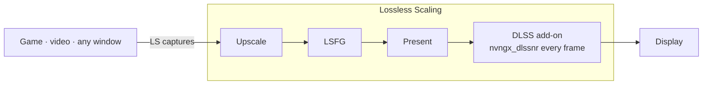

<div align="center">

# dlss5-anywhere

**DLSS 5 Neural Rendering for any game, video or app, through Lossless Scaling.**

[English](README.md) · [Tiếng Việt](README.vi.md)

</div>

> **Version v0.0.1** · a test of how widely this works, not tuned for performance yet.
>
> Last tested 2026-09-06 on an RTX 5070 Ti with Lossless Scaling 3.2.2, ReShade 6.8.0, DLSS SR/RR/FG 310.9.0, NR DLL 310.8.2, NVIDIA driver 616.64.

The idea is simple: instead of installing the DLSS 5 Neural Rendering add-on (NR from here on) into each game, install it into **Lossless Scaling** (LS). Whatever window LS captures gets processed by NR. No game files are touched.

---

## Demo

Split images show the same frame for comparison: NR on the left, NR off on the right. Full-frame images have NR on.

**A YouTube video in the browser**

*Watch a trailer with NR on. What if you could see DLSS 5 before the game even ships?*


**A Wii game through Dolphin**

*An old game on an emulator. Still waiting for a remaster?*


**A mobile game through Google Play Games**

*A familiar mobile title, running with the newest image tech on PC.*


**A PC game without DLSS**

*A game that never supported DLSS. It gets NR anyway.*


**A modern PC game at max settings**

*Already maxed out. What can NR still add?*


The same scene, NR on across the full frame, at 4K.


**Black Myth: Wukong, max settings, 4K**

*One of the best-looking games around. Full-frame NR.*


NR makes the biggest difference on low-texture sources. On images that are already sharp, the change is smaller.

---

## Install

Before you start, you need:

- **An NVIDIA RTX 20 or newer**, driver 616.64 or later. RTX 50 is officially supported; RTX 20–40 runs on a community-built runtime. AMD cards: the community has it working, but this repo has not tried it.
- **[Lossless Scaling](https://store.steampowered.com/app/993090/)**, from Steam.
- **[RHI](https://github.com/RankFTW/RHI/releases)**, a tool that installs ReShade, the add-on and the NR runtime from one place.

This repo ships no DLL files. You download them from their original sources, following the steps below.

There are four steps. Each ends with a **Check** line so you know it worked.

### 1. RHI

Open RHI and find the **Lossless Scaling** card. If it is not there, click *Browse* and point it at the LS install folder. Then, in order:

1. **Components** → *ReShade* → **Install**
2. **Neural Rendering** → *Method* → choose **DLSS Tool (ShortFuse)**. This add-on comes from the [RenoDX Discord channel](https://discord.com/channels/1408098019194310818/1543975158937821315).
3. Open **ShortFuse Settings**, switch *Auto-configure ReShade for FrameGen* to **Off**, click **Save**.
4. **Neural Rendering** → **Install**
5. **Launch** once, then close LS

About step 3: that option is meant for games with DLSS Frame Generation. LS does not need it; left On, RHI renames ReShade and installs an ASI Loader into the LS folder.


**Check:** the status row in RHI shows every tick: `✓ ReShade ✓ DLSS Tool (ShortFuse) ✓ DLSS SR ✓ DLSS RR ✓ DLSS FG`. The LS folder now has a `ReShade.log` whose first line is *Initializing crosire's ReShade*.

### 2. LosslessProxy + LSP-Windowed

These two projects by FrankBarretta let LS capture ordinary windows: browsers, windowed games, emulators. Both are unofficial; the author notes they may violate the LS terms of service. Download only from [LosslessProxy](https://github.com/FrankBarretta/LosslessProxy) and [LSP-Windowed](https://github.com/FrankBarretta/LSP-Windowed). Close LS first.

1. Download `Lossless.dll` from the [LosslessProxy releases page](https://github.com/FrankBarretta/LosslessProxy/releases). In the LS folder, rename the original `Lossless.dll` to `Lossless_original.dll`, then copy the new file in.
2. Download `LSP-Windowed.zip` from the [LSP-Windowed releases page](https://github.com/FrankBarretta/LSP-Windowed/releases) and extract it into `addons\LSP-Windowed\` inside the LS folder.

**Check:** the LS folder has a `LosslessProxy.log` containing the line `Loaded addon 'Windowed Mode'`.

### 3. Get this repo

```
git clone https://github.com/Won-Cafe/dlss5-anywhere
```

Or click **Code › Download ZIP** on GitHub and extract it. Any folder works.

### 4. Run the script

Close LS. Open PowerShell in the repo folder and run:

```powershell
.\scripts\nr-config.ps1
```

The script asks four questions: NR on or off, **Model**, **PassCount**, **HookPoint**. Press Enter to keep the current value. It then asks whether you want the advanced settings, and whether to open LS.


If you pass parameters on the command line, the script skips the questions and writes the config directly. Add `-Launch` to open LS right after.

| Parameter | What it does |
|---|---|
| `-On` / `-Off` | Turns the NR add-on on or off. ReShade stays as is. |
| `-Model A\|B\|C` | Picks the NR model (A, B or C). Start with C. |
| `-PassCount n` | How many times NR runs per frame. More is heavier. |
| `-HookPoint n` | Where the add-on hooks into the image pipeline. 1 is known to work with LS; leave it. |
| `-Intensity x` | Effect strength. Start at 0.6–0.7. Above 1, NR tends to invent detail that is not there. |
| `-AutoMask 0\|1` | Turns the add-on's automatic mask (AutoMask) on or off. |
| `-GlobalTone x` `-LocalTone x` | Global and local tone strength. |
| `-LocalStructure x` `-SkinStructure x` | Surface detail and skin detail strength. |
| `-UiCorrection` `-Encoding` `-WhiteNits` `-WhiteOverride` | HDR and UI settings. Leave at defaults. |
| `-Show` | Prints the current config without writing. |
| `-Launch` | Opens LS. While LS runs, the script temporarily disables WPF hardware acceleration (see [How it works](#how-it-works)). |
| `-LsPath "…"` | Path to the LS folder, for when the script cannot find it. |

If Windows blocks `.ps1` files, use:

```powershell
powershell -ExecutionPolicy Bypass -File .\scripts\nr-config.ps1
```

**Check:** LS opens but is not scaling yet, and GPU usage in Task Manager is near zero. Click **Scale** (`Ctrl+Alt+S`) and the picture changes. `ReShade.log` has a line saying NR initialized successfully.

<details>
<summary>Without RHI</summary>

1. Install [ReShade](https://reshade.me), the **with full add-on support** build, targeting `LosslessScaling.exe`, API **Direct3D 10/11/12**, with every effect package unticked.
2. Copy `renodx-dlss.addon64` and the `nvngx_dlssnr.dll` for your GPU generation (from the [RenoDX Discord channel](https://discord.com/channels/1408098019194310818/1543975158937821315)) into the LS folder. Keep only one `renodx-dlss*.addon64`.
3. Open LS once and close it. Then continue with steps 2, 3 and 4 above.

</details>

---

## Usage

- **Open LS:** use `.\scripts\nr-config.ps1 -Launch`. Opening from Steam or RHI works too, but then NR also processes the LS interface and the GPU stays busy before you scale. For a one-click launch, make a shortcut with this target: `powershell -ExecutionPolicy Bypass -File "<repo folder>\scripts\nr-config.ps1" -Launch`.
- **Compare before and after:** toggle Scale on and off. Or run `-Off -Launch`, then `-On -Launch`.
- **Tune:** close LS, run the script to change settings, reopen LS. Start with Model C, Intensity 0.6–0.7.
- **Update:** in RHI, click **Reinstall** on any row with a new version, then run the script again.
- **Remove:** in RHI, click the red **Remove** button on the Neural Rendering row and the red **✕** on the ReShade row. Both are delete buttons, just different sizes. In the LS folder, delete the proxy `Lossless.dll`, rename `Lossless_original.dll` back to `Lossless.dll`, and delete the `addons\LSP-Windowed` folder.

**LS settings**

The configuration below worked well during testing. Open LS, pick the profile you use, and match the screenshot.


| Section | Setting |
|---|---|
| Frame Generation | LSFG 3.1, Mode **Adaptive**, Target **60**, Flow scale at max, Performance off. |
| Scaling | Type **FSR**, Mode **Auto**, Sharpness in the middle, Optimized version off. |
| Capture | Capture API **WGC**, Queue target **1**. |
| Rendering | Sync mode **Off (Allow tearing)**, Max frame latency **3**, HDR support on. |
| GPU & Display | Preferred GPU **Auto**; with more than one GPU, pick the NVIDIA one directly. Output display: choose the monitor and resolution you want to output to; the higher the resolution, the heavier NR gets. |

---

## Troubleshooting

| Symptom | What to do |
|---|---|
| You press `Ctrl+Alt+S` and nothing changes | Wait a moment. ReShade and the NR add-on need time to start after the first scale. |
| ReShade processes LS the moment it opens, settings window included | LS was opened without the script, so WPF hardware acceleration is still on. Check with `reg query "HKCU\SOFTWARE\Microsoft\Avalon.Graphics"`; it should show `DisableHWAcceleration 0x1`. Close LS and reopen it with `.\scripts\nr-config.ps1 -Launch`. |
| FPS drops | Make sure Frame Generation and Scaling in LS are on, as in the LS settings table; they raise FPS at the cost of some noise. If they are already on, lower the output resolution. |

Still stuck? Open an issue and attach `ReShade.log`, your GPU and driver version, your LS version, and the **Copy Report** output from RHI.

---

## More

### How it works

- LS captures everything on screen and controls the swapchain, the last step before the image reaches the display. Putting the add-on there is enough to apply NR to any source.
- When NR is built into a game, the model receives color, motion vectors and depth. In LS there is only color, so the add-on runs in *Present* mode: once per presented frame. Slow scenes look great; fast motion tends to flicker.
- NR runs at the **output** resolution, on **every presented frame**. The higher the output resolution, the heavier NR gets.
- The LS interface is built with WPF. Unless WPF hardware acceleration is off, NR processes the LS settings window too. The script sets the `DisableHWAcceleration` key while LS runs and restores it when LS closes, because Windows has no per-app switch for this.



### Limitations

- No motion vectors or depth, so the image can flicker or shimmer during fast motion.
- Cost scales with output resolution. NVIDIA says the native RTX 50 integration costs 50–60 % of FPS.
- Everything on screen gets processed, including the HUD, subtitles and UI.
- The NR runtime belongs to NVIDIA. RTX 20–40 and AMD rely on a community-patched runtime, and a new driver can break it.
- Single-player only. With anti-cheat games, the game's rules apply; RHI warns about this at the bottom of its window too.
- The add-on and runtime are community builds, distributed outside GitHub, and change often.

### Legal

- This repo contains documentation and a script only. It does not distribute DLLs from NVIDIA, ReShade, the add-on, or any Lossless Scaling files.
- DLSS, GeForce and RTX are trademarks of NVIDIA. Lossless Scaling belongs to THS. ReShade belongs to crosire. RenoDX belongs to ShortFuse. RHI belongs to RankFTW. LosslessProxy and LSP-Windowed belong to FrankBarretta, who notes they may violate the LS terms of service. None of these parties are affiliated with or endorse this repo.
- Use at your own risk. No warranty. Code is under the MIT license, see [LICENSE](LICENSE).

---

## Credits

This repo stands on other people's work. If you are going to star something, star them first.

- [ReShade](https://github.com/crosire/reshade?ref=dlss5-anywhere) · crosire
- [RenoDX](https://github.com/clshortfuse/renodx?ref=dlss5-anywhere) · ShortFuse, the [`renodx-dlss`](https://discord.com/channels/1408098019194310818/1543975158937821315) add-on
- [RHI](https://github.com/RankFTW/RHI?ref=dlss5-anywhere) · RankFTW
- [LosslessProxy](https://github.com/FrankBarretta/LosslessProxy?ref=dlss5-anywhere) and [LSP-Windowed](https://github.com/FrankBarretta/LSP-Windowed?ref=dlss5-anywhere) · FrankBarretta
- [Lossless Scaling](https://store.steampowered.com/app/993090/?ref=dlss5-anywhere) · THS, on Steam
- [speedlemur](https://github.com/speedlemur?ref=dlss5-anywhere) (first working DLSS 5 NR build) · lecram, Krish · NVIDIA · and the [RenoDX Discord](https://discord.com/channels/1408098019194310818/1543975158937821315), where most of this was figured out in the open

---

## My other project

**[W.O.N](https://github.com/Won-Cafe/W.O.N)** · The Way of Intentional Flow

You know what you want, yet the gap between intention and reality stays open. W.O.N splits the problem into three pillars: **What** is the reality you stand in, **Own** is what belongs to you, **Need** is the means you require. Then it keeps the flow between the three moving, with a crew of AI helpers, each with its own trade, walking alongside you.

Those same helpers built dlss5-anywhere with me, from digging through documentation and writing the script to composing this page.
