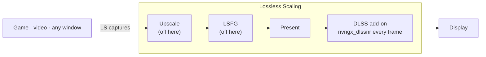

<div align="center">

# dlss5-anywhere

**DLSS 5 Neural Rendering for any game, video or app, through Lossless Scaling.**

[English](README.md) · [Tiếng Việt](README.vi.md)

</div>

> **Version v0.0.6** · One step and one tool less. The NR Cost Scaler is out of the setup: the add-on build from 2026-09-09 runs the model at a lower resolution itself, so `-Scale` is the single dial for FPS ([why](#nr-cost-scaler)). Had the Cost Scaler on before? **Reinstall** Neural Rendering in RHI to get rid of it. Lossless Scaling now runs with frame generation and scaling **off**: generated frames can come out warped and they multiply the neural work ([why](#ls-frame-generation)). Fresh RHI and LS screenshots.
>
> Last tested 2026-09-09 on an RTX 5070 Ti with Lossless Scaling 3.2.2, RHI 2.6.8, ReShade 6.8.0, RenoDX DLSS add-on build 2026-09-09, DLSS SR/RR/FG 310.9.1, NR DLL 310.8.2, NVIDIA driver 616.64.

Install the DLSS 5 Neural Rendering add-on (NR) once, into **Lossless Scaling** (LS), instead of into each game. Whatever LS captures gets NR. Game files are not touched.

---

## Demo

Split images show the same frame for comparison: NR on the left, NR off on the right. Full-frame images have NR on.

**A YouTube video in the browser**

*Watch a trailer with NR on. What if you could see DLSS 5 before the game even ships?*


**A Wii game through Dolphin**

*An old game on an emulator. Still waiting for a remaster?*


The same scene, NR on across the full frame.


**A mobile game through Google Play Games**

*A familiar mobile title, running with the newest image tech on PC.*


**A PC game without DLSS**

*A game that never supported DLSS. It gets NR anyway.*


**A modern PC game at max settings**

*Already maxed out. What can NR still add?*


The same scene, NR on across the full frame, at 4K.


**Black Myth: Wukong, max settings, 4K**

*One of the best-looking games around. Full-frame NR.*


NR makes the biggest difference on low-texture sources. On images that are already sharp, the change is smaller.

---

## Install

You need an **NVIDIA RTX 20 or newer** with driver 616.64 or later ([details](#which-gpus-work)), **[Lossless Scaling](https://store.steampowered.com/app/993090/)** from Steam, and **[RHI](https://github.com/RankFTW/RHI/releases)**, the installer that puts ReShade and the DLSS files in place for you.

Four steps, each with a **Check** line to confirm it worked. Step 2 is optional. Reasons are in [Explained](#explained).

### 1. RHI

Open RHI and find the **Lossless Scaling** card (*Browse* to the LS folder if it is missing). Then, in order:

1. **Components** → *ReShade* → **Install**
2. **Neural Rendering** → *Method* → **DLSS Tool (ShortFuse)**
3. Gear next to **Remove** → **ShortFuse Settings** → *Auto-configure ReShade for FrameGen* **Off** → **Save** ([why](#auto-configure-reshade-for-framegen))
4. **Neural Rendering** → **Install**

Do not open LS yet — the script starts it for the first time in step 4.


**Check:** RHI shows `✓ ReShade ✓ DLSS Tool (ShortFuse) ✓ DLSS SR ✓ DLSS RR ✓ DLSS FG ✓ NR DLL ✗ ASI Loader`, and *NR Cost Scaler* stays **Off**. The LS folder has `dxgi.dll`, `ReShade.ini`, `renodx-dlss.addon64`, `nvngx_dlssnr.dll`.

### 2. LosslessProxy + LSP-Windowed — only for windows

Skip this if you play fullscreen games: LS captures those on its own. These two unofficial add-ons are what let it capture a *window* — browsers, emulators, mobile-game players, windowed games ([details](#losslessproxy-and-lsp-windowed)). Download only from these two pages, and close LS first.

1. [LosslessProxy releases](https://github.com/FrankBarretta/LosslessProxy/releases): in the LS folder rename `Lossless.dll` to `Lossless_original.dll`, then copy the downloaded `Lossless.dll` in.
2. [LSP-Windowed releases](https://github.com/FrankBarretta/LSP-Windowed/releases): extract `LSP-Windowed.zip` into `addons\LSP-Windowed\` inside the LS folder.

**Check:** the LS folder has `LosslessProxy.log` containing `Loaded addon 'Windowed Mode'`.

### 3. Get this repo

```
git clone https://github.com/Won-Cafe/dlss5-anywhere
```

Or **Code › Download ZIP** and extract it anywhere.

### 4. Run the script

In PowerShell, from the repo folder (in Explorer: right-click the folder → *Open in Terminal*):

```powershell
.\scripts\nr-config.ps1
```


It shows the current setup, asks a few questions in plain words, writes `ReShade.ini`, and offers to start LS. Enter keeps the value in brackets; a key that does not exist yet shows a suggested value. The keys LS always needs are written without asking.

With parameters it asks nothing. `-Launch` starts LS afterwards.

| Parameter | What it does |
|---|---|
| `-On` / `-Off` | NR add-on on or off. |
| `-Model A\|B\|C` | NR model. |
| `-PassCount n` | NR passes per frame, 1 to 10. |
| `-Scale n` | Resolution the model runs at, percent of the frame. Lower is faster, 100 = original. The FPS dial. |
| `-Intensity x` | Effect strength, 0 to 1. |
| `-AutoMask 0\|1` | Character mask off or on. |
| `-GlobalTone x` `-LocalTone x` | Tone strength, 0 to 1. |
| `-LocalStructure x` `-SkinStructure x` | Structure strength, 0 to 1. |
| `-UiCorrection` `-Encoding` `-WhiteNits` `-WhiteOverride` | HDR and UI keys. 0 = auto. |
| `-Fps on\|off` | ReShade's FPS counter. |
| `-Ota on\|off` | The driver's online model check, machine-wide. Asks for admin. |
| `-Show` | Print the current setup, write nothing. |
| `-Launch` | Start LS with WPF hardware acceleration off. |
| `-LsPath "…"` | LS folder, if the script cannot find it. |

**Check:** `-Show` prints no warning and no `(missing)`. LS opens without scaling and GPU usage stays near zero. Press **Scale** (`Ctrl+Alt+S`): the picture changes, and `ReShade.log` contains `DLSS-NR direct: attached snippet`.

<details>
<summary>Without RHI</summary>

1. Install [ReShade](https://reshade.me), the **with full add-on support** build, into `LosslessScaling.exe`, API **Direct3D 10/11/12**, no effect packages.
2. Copy `renodx-dlss.addon64` and the `nvngx_dlssnr.dll` for your GPU generation (from the [RenoDX Discord channel](https://discord.com/channels/1408098019194310818/1543975158937821315)) into the LS folder. Keep only one `renodx-dlss*.addon64`.
3. Continue with steps 2, 3 and 4.

</details>

---

## Usage

- **Start LS:** `.\scripts\nr-config.ps1 -Launch`, not Steam ([why](#the-disablehwacceleration-key)). Shortcut target for one click: `powershell -ExecutionPolicy Bypass -File "<repo>\scripts\nr-config.ps1" -Launch`.
- **Before and after:** toggle Scale, or `-Off -Launch` then `-On -Launch`.
- **Tune:** close LS, run the script, start LS again. Good start: Model C, 1 pass, Intensity 0.6–0.7, Scale 75.
- **Update:** RHI → **Reinstall** the rows with a new version, then `-Show` to check the setup survived ([known issues](#known-issues)).
- **Remove:** RHI → **Remove** on Neural Rendering → **✕** on ReShade. In the LS folder delete the proxy `Lossless.dll`, rename `Lossless_original.dll` back, delete `addons\LSP-Windowed`.

**LS settings** that worked in testing. Pick your profile in LS and match the screenshot.


| Section | Setting |
|---|---|
| Frame Generation | Type **Off** ([why](#ls-frame-generation)) |
| Scaling | Type **Off** — here LS only captures and presents. Turn it on only if you want LS to upscale as well |
| Capture | API **WGC**, Queue target **1** |
| Rendering | Sync mode **Default**, Max frame latency **3**, HDR support on, G-Sync on, Draw FPS off |
| GPU & Display | Preferred GPU **Auto**, or the NVIDIA card if you have several. Output display: the monitor and resolution you play on |

---

## Known issues

- **LS can freeze the whole screen when scaling stops.** Unscaling (`Ctrl+Alt+S`) or LS stopping because the game lost focus destroys LS's swapchain while the add-on still uses GPU resources. Outcomes range from LS closing to a GPU fault that needs a hard reset (RTX 5070 Ti, driver 616.64, Application log event *nvlddmkm* 13). The fault is in the add-on's teardown and has been reported. Avoid it: scale once for the whole session, keep the game in front, quit the game before closing LS.
- **NR pays per output frame.** Two passes cost twice, frame generation would multiply the work, 4K is about four times 1080p. Roughly 20 ms per pass at 4K on an RTX 5070 Ti; `-Scale` brings that down ([why](#ls-frame-generation)).
- **The first Scale can take a minute** while the driver asks NVIDIA's servers for models. `-Ota off`.
- **RHI reinstalls can undo the setup.** *Auto-configure ReShade for FrameGen* can come back on. Run `-Show` after any RHI action; the script warns and writes the keys again.

---

## Troubleshooting

| Symptom | What to do |
|---|---|
| `Ctrl+Alt+S` and nothing changes | Wait. The add-on needs a few seconds after the first scale. A minute or more: `-Ota off`. |
| Scaling works, no NR | `-Show`. A warning: see the next row. `(missing)`: run the script once and press Enter through it. Line 1 of `ReShade.log` must say *loaded from … dxgi.dll*. `-Fps on` shows whether ReShade draws at all. |
| `ReShade.log` line 1 says *Reshade64.asi* | RHI put ReShade behind an ASI loader, which in LS fires only at exit. RHI → gear → **ShortFuse Settings** → *Auto-configure ReShade for FrameGen* **Off** → **Save** → **Reinstall**. |
| LS crashes on start, or the LS window itself gets NR | LS was started without the script. `reg query "HKCU\SOFTWARE\Microsoft\Avalon.Graphics"` should show `DisableHWAcceleration 0x1`. Close LS, `-Launch`. |
| Defender flags `RHI\downloads\…\shaders_DLSS5Feeder.zip` | RHI downloads the DLSS5 Feeder package on its own. This setup does not use it. |
| PowerShell: *running scripts is disabled* or *not digitally signed* | `powershell -ExecutionPolicy Bypass -File .\scripts\nr-config.ps1`. From a ZIP: right-click the script → Properties → **Unblock**. |
| Low FPS | `-Scale 75`, then lower. One pass. Then lower the output resolution in LS (GPU & Display → Output display). |

Still stuck? Open an issue with `ReShade.log`, GPU and driver, LS version, and RHI's **Copy Report**.

---

## Explained

### How it works

LS captures a window and owns the swapchain, the last stop before the display. The add-on hooks that swapchain, so every frame LS presents goes through NR. A game with built-in NR gives the model color, motion vectors and depth; LS has only color, so the add-on runs in *Present* mode, once per presented frame, at the output resolution. Still scenes look best; fast motion can flicker.



### Why each step

#### Which GPUs work

RTX 50 is supported by NVIDIA. RTX 20–40 run on a community-patched NR runtime that a new driver can break. AMD: the community has it working, untested here. This repo ships no DLLs; RHI downloads them from their sources.

#### The DLSS Tool (ShortFuse) add-on

ShortFuse's `renodx-dlss` ReShade add-on, distributed on the [RenoDX Discord](https://discord.com/channels/1408098019194310818/1543975158937821315) and updated often. RHI installs it but does not write its NR keys. The script writes the three LS needs on every run: `DirectNeuralRenderingRequireDlss=0` (allow a host without native DLSS), `DirectNeuralRenderingHookPoint=1` (builds before 2026-09-09) and `DirectNeuralRenderingHookMethod=2` (builds from 2026-09-09); each build ignores the other's key.

#### Auto-configure ReShade for FrameGen

Meant for games with DLSS Frame Generation: it renames ReShade to `Reshade64.asi` behind an ASI loader. In LS that loader runs only at exit, so ReShade is never there when you scale.

#### NR Cost Scaler

Leave it **off**. [DLSSNR-Cost-Scaler](https://github.com/xenmods/DLSSNR-Cost-Scaler) by xenmods ran the model at a lower resolution back when the add-on could not — the trick that made NR affordable. The 2026-09-09 add-on build has it built in (`DirectNeuralRenderingProcessingScale`, the script's `-Scale`), so a second scaler would only scale the same frame twice. If you switched it on in an earlier setup, remove it: RHI → *NR Cost Scaler* **Off** → **Reinstall** on Neural Rendering, which puts the original `nvngx_dlssnr.dll` back. The script ignores it either way.

#### LosslessProxy and LSP-Windowed

Stock LS captures fullscreen games only. FrankBarretta's proxy `Lossless.dll` plus the Windowed Mode add-on let it capture browsers, windowed games and emulators. Unofficial; the author notes they may violate the LS terms of service.

#### The DisableHWAcceleration key

LS's own window is WPF, which draws through D3D, so NR would process the settings window too. There is no per-app switch, so the script sets `HKCU\SOFTWARE\Microsoft\Avalon.Graphics\DisableHWAcceleration` while LS runs and restores it afterwards, with a marker so an interrupted run is cleaned up next time. Starting LS from Steam skips this.

#### LS Frame Generation

Keep it off. NR runs on every frame LS outputs, generated frames included, so frame generation multiplies the neural work instead of adding cheap frames, and the NR cost per frame caps the output FPS anyway. With NR in the present path the generated frames can also come out visibly warped.

### Limitations

- No motion vectors or depth: flicker and shimmer in fast motion.
- Cost scales with output resolution. NVIDIA quotes 50–60 % of FPS for the native RTX 50 integration.
- Everything on screen is processed, HUD and subtitles included.
- Single-player only. Anti-cheat games follow their own rules; RHI warns about this too.
- Add-on and runtime are community builds, distributed outside GitHub, and change often.

### Legal

- This repo contains documentation and a script. It distributes no DLLs from NVIDIA, ReShade, the add-on, or Lossless Scaling.
- DLSS, GeForce and RTX are trademarks of NVIDIA. Lossless Scaling belongs to THS. ReShade belongs to crosire. RenoDX belongs to ShortFuse. RHI belongs to RankFTW. DLSSNR-Cost-Scaler belongs to xenmods. LosslessProxy and LSP-Windowed belong to FrankBarretta, who notes they may violate the LS terms of service. None of them are affiliated with or endorse this repo.
- Use at your own risk. No warranty. Code is under the MIT license, see [LICENSE](LICENSE).

---

## Credits

This repo stands on other people's work. If you are going to star something, star them first.

- [ReShade](https://github.com/crosire/reshade?ref=dlss5-anywhere) · crosire
- [RenoDX](https://github.com/clshortfuse/renodx?ref=dlss5-anywhere) · ShortFuse, the [`renodx-dlss`](https://discord.com/channels/1408098019194310818/1543975158937821315) add-on
- [RHI](https://github.com/RankFTW/RHI?ref=dlss5-anywhere) · RankFTW
- [DLSSNR-Cost-Scaler](https://github.com/xenmods/DLSSNR-Cost-Scaler?ref=dlss5-anywhere) · xenmods
- [LosslessProxy](https://github.com/FrankBarretta/LosslessProxy?ref=dlss5-anywhere) and [LSP-Windowed](https://github.com/FrankBarretta/LSP-Windowed?ref=dlss5-anywhere) · FrankBarretta
- [Lossless Scaling](https://store.steampowered.com/app/993090/?ref=dlss5-anywhere) · THS, on Steam
- [speedlemur](https://github.com/speedlemur?ref=dlss5-anywhere) (first working DLSS 5 NR build) · lecram, Krish · NVIDIA · and the [RenoDX Discord](https://discord.com/channels/1408098019194310818/1543975158937821315), where most of this was figured out in the open

---

## My other project

**[W.O.N](https://github.com/Won-Cafe/W.O.N)** · The Way of Intentional Flow

You know what you want, yet the gap between intention and reality stays open. W.O.N splits the problem into three pillars: **What** is the reality you stand in, **Own** is what belongs to you, **Need** is the means you require. Then it keeps the flow between the three moving, with a crew of AI helpers, each with its own trade, walking alongside you.

Those same helpers built dlss5-anywhere with me, from digging through documentation and writing the script to composing this page.
