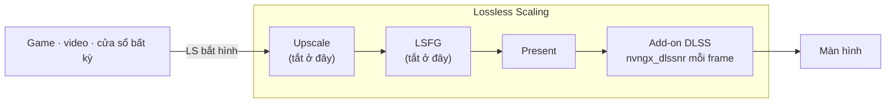

<div align="center">

# dlss5-anywhere

**DLSS 5 Neural Rendering cho mọi game, video hay ứng dụng, thông qua Lossless Scaling.**

[English](README.md) · [Tiếng Việt](README.vi.md)

</div>

> **Version v0.0.6** · Bớt một bước và một tool. NR Cost Scaler ra khỏi thiết lập: bản add-on ngày 09/09/2026 tự chạy model ở độ phân giải thấp hơn, nên `-Scale` là nút duy nhất để đổi FPS ([vì sao](#nr-cost-scaler)). Trước có bật Cost Scaler? **Reinstall** Neural Rendering trong RHI để xoá nó đi. Lossless Scaling giờ chạy với frame generation và scaling **tắt**: frame nội suy có thể méo hình và còn nhân thêm việc cho model ([vì sao](#frame-generation-của-ls)). Ảnh RHI và LS chụp lại mới.
>
> Đã chạy thử ngày 09/09/2026 trên RTX 5070 Ti với Lossless Scaling 3.2.2, RHI 2.6.8, ReShade 6.8.0, add-on RenoDX DLSS build 2026-09-09, DLSS SR/RR/FG 310.9.1, NR DLL 310.8.2, driver NVIDIA 616.64.

Cài add-on DLSS 5 Neural Rendering (NR) một lần, vào **Lossless Scaling** (LS), thay vì vào từng game. LS bắt hình cửa sổ nào thì cửa sổ đó có NR. Không đụng file game.

---

## Demo

Ảnh chia đôi là cùng một khung hình để so sánh: nửa trái bật NR, nửa phải tắt NR. Ảnh toàn khung là NR bật.

**Video YouTube trong trình duyệt**

*Xem trailer với NR bật. Trải nghiệm DLSS 5 trước cả khi game ra mắt thì sao?*


**Game Wii qua Dolphin**

*Game cũ trên giả lập. Còn cần chờ bản remastered nữa không?*


Cùng cảnh đó, NR bật trên toàn khung hình.


**Game mobile qua Google Play Games**

*Tựa game mobile quen thuộc, chạy với công nghệ hình ảnh mới nhất của PC.*


**Game PC không có DLSS**

*Game chưa từng hỗ trợ DLSS. Giờ vẫn có NR.*


**Game PC hiện đại, max settings**

*Đã max settings rồi. NR còn thêm được gì nữa?*


Cùng cảnh đó, NR bật trên toàn khung hình, độ phân giải 4K.


**Black Myth: Wukong, max settings, 4K**

*Một trong những game đẹp nhất hiện nay. NR bật toàn khung.*


Hiệu quả của NR rõ nhất ở nguồn có texture thấp. Với hình vốn đã sắc nét, khác biệt nhỏ hơn.

---

## Cài đặt

Cần **NVIDIA RTX 20 trở lên** với driver 616.64 trở lên ([chi tiết](#gpu-nào-chạy-được)), **[Lossless Scaling](https://store.steampowered.com/app/993090/)** trên Steam, và **[RHI](https://github.com/RankFTW/RHI/releases)** — công cụ cài ReShade và các file DLSS thay cho bạn.

Bốn bước, mỗi bước có một dòng **Kiểm** để biết đã đúng chưa. Bước 2 không bắt buộc. Lý do nằm ở [Giải thích](#giải-thích).

### 1. RHI

Mở RHI, tìm thẻ **Lossless Scaling** (*Browse* tới thư mục LS nếu chưa thấy). Rồi làm lần lượt:

1. **Components** → *ReShade* → **Install**
2. **Neural Rendering** → *Method* → **DLSS Tool (ShortFuse)**
3. Bánh răng cạnh **Remove** → **ShortFuse Settings** → *Auto-configure ReShade for FrameGen* **Off** → **Save** ([vì sao](#auto-configure-reshade-for-framegen))
4. **Neural Rendering** → **Install**

Chưa mở LS — script sẽ mở LS lần đầu ở bước 4.


**Kiểm:** RHI hiện `✓ ReShade ✓ DLSS Tool (ShortFuse) ✓ DLSS SR ✓ DLSS RR ✓ DLSS FG ✓ NR DLL ✗ ASI Loader`, và *NR Cost Scaler* để **Off**. Thư mục LS có `dxgi.dll`, `ReShade.ini`, `renodx-dlss.addon64`, `nvngx_dlssnr.dll`.

### 2. LosslessProxy + LSP-Windowed — chỉ khi cần bắt cửa sổ

Bỏ qua bước này nếu bạn chơi game fullscreen: LS tự bắt được. Hai add-on không chính thức này là thứ giúp nó bắt được một *cửa sổ* — trình duyệt, giả lập, app chơi game mobile, game chạy cửa sổ ([chi tiết](#losslessproxy-và-lsp-windowed)). Chỉ tải từ hai trang này, và đóng LS trước.

1. [LosslessProxy releases](https://github.com/FrankBarretta/LosslessProxy/releases): trong thư mục LS đổi tên `Lossless.dll` thành `Lossless_original.dll`, rồi chép `Lossless.dll` vừa tải vào.
2. [LSP-Windowed releases](https://github.com/FrankBarretta/LSP-Windowed/releases): giải nén `LSP-Windowed.zip` vào `addons\LSP-Windowed\` trong thư mục LS.

**Kiểm:** thư mục LS có `LosslessProxy.log` với dòng `Loaded addon 'Windowed Mode'`.

### 3. Lấy repo

```
git clone https://github.com/Won-Cafe/dlss5-anywhere
```

Hoặc **Code › Download ZIP** rồi giải nén ở đâu cũng được.

### 4. Chạy script

Trong PowerShell, tại thư mục repo (trong Explorer: chuột phải thư mục → *Open in Terminal*):

```powershell
.\scripts\nr-config.ps1
```


Script hiện thiết lập hiện tại, hỏi vài câu bằng lời thường, ghi `ReShade.ini`, rồi hỏi mở LS. Enter giữ giá trị trong ngoặc; khóa chưa có thì ngoặc hiện giá trị đề xuất. Các khóa LS luôn cần được ghi mà không hỏi.

Có tham số thì không hỏi gì. `-Launch` mở LS sau khi ghi.

| Tham số | Tác dụng |
|---|---|
| `-On` / `-Off` | Bật hoặc tắt add-on NR. |
| `-Model A\|B\|C` | Model NR. |
| `-PassCount n` | Số pass NR mỗi frame, 1 đến 10. |
| `-Scale n` | Độ phân giải model chạy, phần trăm khung hình. Càng thấp càng nhanh, 100 = như gốc. Đây là nút đổi FPS. |
| `-Intensity x` | Độ mạnh hiệu ứng, 0 đến 1. |
| `-AutoMask 0\|1` | Mặt nạ nhân vật tắt hoặc bật. |
| `-GlobalTone x` `-LocalTone x` | Độ mạnh tone, 0 đến 1. |
| `-LocalStructure x` `-SkinStructure x` | Độ mạnh chi tiết bề mặt, 0 đến 1. |
| `-UiCorrection` `-Encoding` `-WhiteNits` `-WhiteOverride` | Các khóa HDR và giao diện. 0 = auto. |
| `-Fps on\|off` | Bộ đếm FPS của ReShade. |
| `-Ota on\|off` | Bước driver kiểm tra model qua mạng, toàn máy. Hỏi quyền admin. |
| `-Show` | In thiết lập hiện tại, không ghi gì. |
| `-Launch` | Mở LS với hardware acceleration của WPF tắt. |
| `-LsPath "…"` | Thư mục LS, khi script không tự tìm được. |

**Kiểm:** `-Show` không có cảnh báo và không có `(missing)`. LS mở lên chưa scale, GPU gần 0. Bấm **Scale** (`Ctrl+Alt+S`): hình đổi khác, và `ReShade.log` có dòng `DLSS-NR direct: attached snippet`.

<details>
<summary>Không dùng RHI</summary>

1. Cài [ReShade](https://reshade.me), bản **with full add-on support**, vào `LosslessScaling.exe`, API **Direct3D 10/11/12**, không chọn gói hiệu ứng nào.
2. Chép `renodx-dlss.addon64` và `nvngx_dlssnr.dll` đúng đời GPU (từ [kênh Discord RenoDX](https://discord.com/channels/1408098019194310818/1543975158937821315)) vào thư mục LS. Chỉ giữ một file `renodx-dlss*.addon64`.
3. Làm tiếp bước 2, 3 và 4.

</details>

---

## Cách dùng

- **Mở LS:** `.\scripts\nr-config.ps1 -Launch`, không mở từ Steam ([vì sao](#khoá-disablehwacceleration)). Shortcut một click: `powershell -ExecutionPolicy Bypass -File "<repo>\scripts\nr-config.ps1" -Launch`.
- **So trước sau:** bật tắt Scale, hoặc `-Off -Launch` rồi `-On -Launch`.
- **Chỉnh:** đóng LS, chạy script, mở LS lại. Khởi điểm tốt: Model C, 1 pass, Intensity 0.6–0.7, Scale 75.
- **Cập nhật:** RHI → **Reinstall** hàng có bản mới, rồi `-Show` để chắc thiết lập còn nguyên ([vấn đề đã biết](#vấn-đề-đã-biết)).
- **Gỡ:** RHI → **Remove** ở Neural Rendering → **✕** ở ReShade. Trong thư mục LS xóa `Lossless.dll` proxy, đổi tên `Lossless_original.dll` lại, xóa `addons\LSP-Windowed`.

**Thiết lập LS** đã chạy tốt khi thử. Chọn profile trong LS và chỉnh theo ảnh.


| Mục | Thiết lập |
|---|---|
| Frame Generation | Type **Off** ([vì sao](#frame-generation-của-ls)) |
| Scaling | Type **Off** — ở đây LS chỉ chụp và present. Chỉ bật khi bạn muốn LS upscale luôn |
| Capture | API **WGC**, Queue target **1** |
| Rendering | Sync mode **Default**, Max frame latency **3**, HDR support bật, G-Sync bật, Draw FPS tắt |
| GPU & Display | Preferred GPU **Auto**, hoặc chọn thẳng card NVIDIA nếu có nhiều card. Output display: màn hình và độ phân giải bạn chơi |

---

## Vấn đề đã biết

- **LS có thể treo cả màn hình khi dừng scale.** Unscale (`Ctrl+Alt+S`) hay LS tự dừng vì game mất focus làm LS hủy swapchain trong khi add-on còn dùng tài nguyên GPU. Hậu quả từ LS đóng tới lỗi GPU phải reset máy (RTX 5070 Ti, driver 616.64, Application log sự kiện *nvlddmkm* 13). Lỗi nằm ở phần teardown của add-on và đã được báo. Cách tránh: scale một lần cho cả phiên, giữ game ở trước, thoát game trước khi đóng LS.
- **NR trả chi phí theo từng frame output.** Hai pass tốn gấp đôi, bật frame generation sẽ nhân khối lượng lên, 4K nặng khoảng bốn lần 1080p. Khoảng 20 ms mỗi pass ở 4K trên RTX 5070 Ti; `-Scale` kéo xuống ([vì sao](#frame-generation-của-ls)).
- **Lần Scale đầu có thể mất một phút** vì driver hỏi máy chủ NVIDIA về model. `-Ota off`.
- **Cài lại qua RHI có thể làm hỏng thiết lập.** *Auto-configure ReShade for FrameGen* có thể bật lại. Sau mỗi thao tác RHI chạy `-Show`: script cảnh báo và ghi lại các khóa.

---

## Lỗi thường gặp

| Triệu chứng | Cách xử lý |
|---|---|
| `Ctrl+Alt+S` mà không có gì đổi | Chờ. Add-on cần vài giây sau lần scale đầu. Từ một phút trở lên: `-Ota off`. |
| Scale chạy, không có NR | `-Show`. Có cảnh báo: xem hàng dưới. `(missing)`: chạy script một lần và Enter hết. Dòng 1 của `ReShade.log` phải là *loaded from … dxgi.dll*. `-Fps on` cho biết ReShade có vẽ không. |
| Dòng 1 `ReShade.log` ghi *Reshade64.asi* | RHI cài ReShade sau ASI loader, trong LS loader đó chỉ chạy lúc thoát. RHI → bánh răng → **ShortFuse Settings** → *Auto-configure ReShade for FrameGen* **Off** → **Save** → **Reinstall**. |
| LS crash khi mở, hoặc chính cửa sổ LS bị NR | LS được mở không qua script. `reg query "HKCU\SOFTWARE\Microsoft\Avalon.Graphics"` phải thấy `DisableHWAcceleration 0x1`. Đóng LS, `-Launch`. |
| Defender báo `RHI\downloads\…\shaders_DLSS5Feeder.zip` | RHI tự tải gói DLSS5 Feeder. Setup này không dùng nó. |
| PowerShell: *running scripts is disabled* hoặc *not digitally signed* | `powershell -ExecutionPolicy Bypass -File .\scripts\nr-config.ps1`. Tải dạng ZIP: chuột phải script → Properties → **Unblock**. |
| FPS thấp | `-Scale 75`, rồi thấp hơn nữa. Một pass. Rồi hạ độ phân giải output trong LS (GPU & Display → Output display). |

Vẫn kẹt? Mở issue kèm `ReShade.log`, GPU và driver, phiên bản LS, và **Copy Report** của RHI.

---

## Giải thích

### Cách chạy

LS bắt một cửa sổ và giữ swapchain, chặng cuối trước khi hình ra màn hình. Add-on hook vào swapchain đó, nên mỗi frame LS present đều qua NR. Game có NR gốc đưa cho model màu, motion vector và depth; LS chỉ có màu, nên add-on chạy ở chế độ *Present*, mỗi frame một lần, ở độ phân giải output. Cảnh tĩnh đẹp nhất; chuyển động nhanh có thể nhấp nháy.



### Vì sao từng bước

#### GPU nào chạy được

RTX 50 được NVIDIA hỗ trợ. RTX 20–40 chạy trên runtime NR do cộng đồng patch, driver mới có thể làm hỏng. AMD: cộng đồng đã chạy được, ở đây chưa thử. Repo không ship DLL; RHI tải từ nguồn gốc.

#### Add-on DLSS Tool (ShortFuse)

Add-on ReShade `renodx-dlss` của ShortFuse, phân phối trên [Discord RenoDX](https://discord.com/channels/1408098019194310818/1543975158937821315) và đổi thường xuyên. RHI cài nó nhưng không ghi khóa NR. Script ghi ba khóa LS cần ở mỗi lần chạy: `DirectNeuralRenderingRequireDlss=0` (cho phép host không có DLSS gốc), `DirectNeuralRenderingHookPoint=1` (bản trước 2026-09-09) và `DirectNeuralRenderingHookMethod=2` (bản từ 2026-09-09); mỗi bản bỏ qua khóa của bản kia.

#### Auto-configure ReShade for FrameGen

Dành cho game có DLSS Frame Generation: đổi tên ReShade thành `Reshade64.asi` sau một ASI loader. Trong LS loader đó chỉ chạy lúc thoát, nên lúc scale không có ReShade.

#### NR Cost Scaler

Để **tắt**. [DLSSNR-Cost-Scaler](https://github.com/xenmods/DLSSNR-Cost-Scaler) của xenmods chạy model ở độ phân giải thấp hơn từ thời add-on chưa làm được — chính là mẹo làm NR đủ nhẹ để dùng. Bản add-on ngày 09/09/2026 đã có sẵn (`DirectNeuralRenderingProcessingScale`, tức `-Scale` của script), nên thêm một lớp co giãn nữa chỉ làm khung hình bị co giãn hai lần. Nếu trước đây bạn có bật, hãy xoá đi: RHI → *NR Cost Scaler* **Off** → **Reinstall** ở Neural Rendering, bước này trả lại `nvngx_dlssnr.dll` gốc. Script thì không can thiệp gì tới nó.

#### LosslessProxy và LSP-Windowed

LS gốc chỉ bắt game toàn màn hình. `Lossless.dll` proxy và add-on Windowed Mode của FrankBarretta cho LS bắt trình duyệt, game windowed, emulator. Không chính thức; tác giả lưu ý có thể vi phạm điều khoản của LS.

#### Khoá DisableHWAcceleration

Cửa sổ của chính LS là WPF, vẽ qua D3D, nên NR sẽ xử lý cả cửa sổ thiết lập. Không có khoá riêng cho từng app, nên script bật `HKCU\SOFTWARE\Microsoft\Avalon.Graphics\DisableHWAcceleration` trong lúc LS chạy rồi trả lại, kèm một dấu để dọn nếu lần trước bị ngắt. Mở LS từ Steam thì bỏ qua bước này.

#### Frame Generation của LS

Để tắt. NR chạy trên mỗi frame LS xuất ra, gồm cả frame nội suy, nên frame generation nhân khối lượng NR thay vì thêm frame rẻ, mà chi phí NR mỗi frame vốn đã đặt trần cho FPS output. Có NR trong đường present, frame nội suy còn có thể bị méo hình rõ rệt.

### Giới hạn

- Không có motion vector và depth: nhấp nháy, rung gợn khi chuyển động nhanh.
- Chi phí theo độ phân giải output. NVIDIA nêu 50–60 % FPS cho tích hợp gốc trên RTX 50.
- Mọi thứ trên màn hình đều bị xử lý, kể cả HUD và phụ đề.
- Chỉ game chơi đơn. Game có anti-cheat theo luật của game đó; RHI cũng cảnh báo.
- Add-on và runtime là bản cộng đồng, phân phối ngoài GitHub, đổi thường xuyên.

### Pháp lý

- Repo chỉ chứa tài liệu và script. Không phân phối DLL của NVIDIA, ReShade, add-on hay Lossless Scaling.
- DLSS, GeForce, RTX là nhãn hiệu của NVIDIA. Lossless Scaling thuộc THS. ReShade thuộc crosire. RenoDX thuộc ShortFuse. RHI thuộc RankFTW. DLSSNR-Cost-Scaler thuộc xenmods. LosslessProxy và LSP-Windowed thuộc FrankBarretta; tác giả lưu ý chúng có thể vi phạm điều khoản sử dụng của LS. Không bên nào trong số này liên quan hay xác nhận repo này.
- Bạn tự chịu rủi ro khi dùng. Không có bảo hành. Mã nguồn theo giấy phép MIT, xem [LICENSE](LICENSE).

---

## Ghi công

Repo này dựa trên công sức của nhiều người khác. Nếu định tặng sao, hãy tặng họ trước.

- [ReShade](https://github.com/crosire/reshade?ref=dlss5-anywhere) · crosire
- [RenoDX](https://github.com/clshortfuse/renodx?ref=dlss5-anywhere) · ShortFuse, add-on [`renodx-dlss`](https://discord.com/channels/1408098019194310818/1543975158937821315)
- [RHI](https://github.com/RankFTW/RHI?ref=dlss5-anywhere) · RankFTW
- [DLSSNR-Cost-Scaler](https://github.com/xenmods/DLSSNR-Cost-Scaler?ref=dlss5-anywhere) · xenmods
- [LosslessProxy](https://github.com/FrankBarretta/LosslessProxy?ref=dlss5-anywhere) và [LSP-Windowed](https://github.com/FrankBarretta/LSP-Windowed?ref=dlss5-anywhere) · FrankBarretta
- [Lossless Scaling](https://store.steampowered.com/app/993090/?ref=dlss5-anywhere) · THS, trên Steam
- [speedlemur](https://github.com/speedlemur?ref=dlss5-anywhere) (người làm bản NR DLSS 5 chạy được đầu tiên) · lecram, Krish · NVIDIA · và [Discord RenoDX](https://discord.com/channels/1408098019194310818/1543975158937821315), nơi phần lớn những thứ này được mày mò công khai

---

## Dự án khác của tôi

**[W.O.N](https://github.com/Won-Cafe/W.O.N)** · The Way of Intentional Flow

Bạn biết mình muốn gì, nhưng khoảng trống từ ý định đến thực tại vẫn còn đó. W.O.N chia bài toán thành ba trụ: **What** là thực tại bạn đang đứng, **Own** là cái thuộc về bạn, **Need** là phương tiện bạn cần. Rồi nó giữ cho dòng giữa ba trụ tiếp tục chảy, với các đệ, những trợ thủ AI mỗi đệ một nghề, đi cùng bạn.

Chính các đệ đó đã cùng tôi dựng dlss5-anywhere, từ dò tài liệu, viết script đến soạn trang này.
