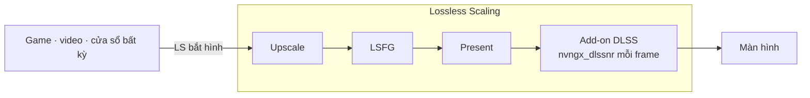

<div align="center">

# dlss5-anywhere

**DLSS 5 Neural Rendering cho mọi game, video hay app, qua Lossless Scaling.**

[English](README.md) · [Tiếng Việt](README.vi.md)

</div>

> **Version v0.0.1** · bản thử nghiệm tính đa dụng, chưa tối ưu hiệu năng.
>
> Đã chạy thử ngày 06/09/2026 trên RTX 5070 Ti với Lossless Scaling 3.2.2, ReShade 6.8.0, DLSS SR/RR/FG 310.9.0, NR DLL 310.8.2, driver NVIDIA 616.64.

Ý tưởng rất đơn giản: thay vì cài add-on DLSS 5 Neural Rendering (gọi tắt là NR) vào từng game, ta cài nó vào **Lossless Scaling** (gọi tắt là LS). LS bắt được hình của cửa sổ nào thì hình đó sẽ được NR xử lý. Không cần chỉnh sửa file của game.

---

## Demo

Ảnh chia đôi là cùng một khung hình để so sánh: nửa trái bật NR, nửa phải tắt NR. Ảnh toàn khung là NR bật.

**Video YouTube trong trình duyệt**

*Xem trailer với NR bật. Trải nghiệm DLSS 5 trước cả khi game ra mắt thì sao?*


**Game Wii qua Dolphin**

*Game cũ trên giả lập. Còn cần chờ bản remastered nữa không?*


**Game mobile qua Google Play Games**

*Tựa game mobile quen thuộc, chạy với công nghệ hình ảnh mới nhất của PC.*


**Game PC không có DLSS**

*Game chưa từng hỗ trợ DLSS. Giờ vẫn có NR.*


**Game PC hiện đại, max settings**

*Đã max settings rồi. NR còn thêm được gì nữa?*


Cùng cảnh đó, NR bật trên toàn khung hình, độ phân giải 4K.


**Black Myth: Wukong, max settings, 4K**

*Một trong những game đẹp nhất hiện nay. NR bật toàn khung.*


Hiệu quả của NR rõ nhất ở nguồn có texture thấp. Với hình vốn đã sắc nét, khác biệt nhỏ hơn.

---

## Cài đặt

Trước khi bắt đầu, bạn cần:

- **Card NVIDIA RTX 20 trở lên**, driver 616.64 trở lên. RTX 50 được hỗ trợ chính thức; RTX 20–40 chạy qua runtime do cộng đồng làm. Card AMD: cộng đồng đã chạy được, nhưng repo này chưa thử.
- **[Lossless Scaling](https://store.steampowered.com/app/993090/)**, mua trên Steam.
- **[RHI](https://github.com/RankFTW/RHI/releases)**, công cụ cài ReShade, add-on và runtime NR ở một chỗ.

Repo này không chứa file DLL nào; bạn tải chúng từ nguồn gốc theo hướng dẫn bên dưới.

Có bốn bước. Cuối mỗi bước có một dòng **Kiểm** để bạn biết bước đó đã xong hay chưa.

### 1. RHI

Mở RHI và tìm thẻ **Lossless Scaling**. Nếu không thấy, bấm *Browse* và trỏ tới thư mục cài LS. Sau đó làm lần lượt:

1. **Components** → *ReShade* → **Install**
2. **Neural Rendering** → *Method* chọn **DLSS Tool (ShortFuse)**. Add-on này lấy từ [kênh Discord RenoDX](https://discord.com/channels/1408098019194310818/1543975158937821315).
3. Mở **ShortFuse Settings**, gạt *Auto-configure ReShade for FrameGen* sang **Off**, bấm **Save**.
4. **Neural Rendering** → **Install**
5. **Launch** một lần, rồi đóng LS

Về bước 3: tuỳ chọn đó dành cho game có DLSS Frame Generation. LS không cần nó; nếu để On, RHI sẽ đổi tên ReShade và cài thêm ASI Loader vào thư mục LS.


**Kiểm:** dòng trạng thái trong RHI hiện đủ các dấu tick `✓ ReShade ✓ DLSS Tool (ShortFuse) ✓ DLSS SR ✓ DLSS RR ✓ DLSS FG`. Trong thư mục LS xuất hiện file `ReShade.log`, dòng đầu là *Initializing crosire's ReShade*.

### 2. LosslessProxy + LSP-Windowed

Hai dự án này của FrankBarretta giúp LS bắt được cửa sổ thường: trình duyệt, game chạy windowed, emulator. Cả hai đều không chính thức; tác giả lưu ý có thể vi phạm điều khoản sử dụng của LS. Chỉ tải từ hai địa chỉ [LosslessProxy](https://github.com/FrankBarretta/LosslessProxy) và [LSP-Windowed](https://github.com/FrankBarretta/LSP-Windowed). Đóng LS trước khi làm.

1. Tải `Lossless.dll` từ [trang release LosslessProxy](https://github.com/FrankBarretta/LosslessProxy/releases). Vào thư mục LS, đổi tên file `Lossless.dll` gốc thành `Lossless_original.dll`, rồi chép file mới tải vào.
2. Tải `LSP-Windowed.zip` từ [trang release LSP-Windowed](https://github.com/FrankBarretta/LSP-Windowed/releases), giải nén vào thư mục `addons\LSP-Windowed\` trong thư mục LS.

**Kiểm:** trong thư mục LS có file `LosslessProxy.log`, bên trong có dòng `Loaded addon 'Windowed Mode'`.

### 3. Lấy repo

```
git clone https://github.com/Won-Cafe/dlss5-anywhere
```

Hoặc bấm **Code › Download ZIP** trên GitHub rồi giải nén. Đặt ở thư mục nào cũng được.

### 4. Chạy script

Đóng LS. Mở PowerShell trong thư mục repo và chạy:

```powershell
.\scripts\nr-config.ps1
```

Script sẽ hỏi bốn câu: bật hay tắt NR, **Model**, **PassCount**, **HookPoint**. Bấm Enter để giữ giá trị hiện tại. Sau đó nó hỏi có muốn vào phần thiết lập nâng cao không, rồi hỏi có mở LS luôn không.


Nếu bạn truyền tham số ngay trên dòng lệnh, script sẽ không hỏi mà ghi thẳng cấu hình. Thêm `-Launch` để mở LS ngay sau khi ghi.

| Tham số | Tác dụng |
|---|---|
| `-On` / `-Off` | Bật hoặc tắt add-on NR. ReShade vẫn giữ nguyên. |
| `-Model A\|B\|C` | Chọn model NR (A, B hoặc C). Nên bắt đầu với C. |
| `-PassCount n` | Số lần NR chạy trên mỗi frame. Càng nhiều càng nặng máy. |
| `-HookPoint n` | Vị trí add-on chen vào chuỗi xử lý hình. Giá trị 1 đã chạy được với LS, không cần đổi. |
| `-Intensity x` | Độ mạnh của hiệu ứng. Nên bắt đầu ở 0.6–0.7. Trên 1, NR dễ bịa thêm chi tiết không có thật. |
| `-AutoMask 0\|1` | Bật hoặc tắt mặt nạ tự động (AutoMask) của add-on. |
| `-GlobalTone x` `-LocalTone x` | Tone màu toàn khung và tone cục bộ. |
| `-LocalStructure x` `-SkinStructure x` | Độ chi tiết vân bề mặt và vân da người. |
| `-UiCorrection` `-Encoding` `-WhiteNits` `-WhiteOverride` | Các thiết lập HDR và giao diện. Nên để mặc định. |
| `-Show` | Chỉ xem cấu hình hiện tại, không ghi. |
| `-Launch` | Mở LS. Trong lúc LS chạy, script tắt tạm hardware acceleration của WPF (xem phần [Cách chạy](#cách-chạy)). |
| `-LsPath "…"` | Chỉ đường dẫn tới thư mục LS, dùng khi script không tự tìm thấy. |

Nếu Windows chặn không cho chạy file `.ps1`, dùng lệnh:

```powershell
powershell -ExecutionPolicy Bypass -File .\scripts\nr-config.ps1
```

**Kiểm:** LS mở lên nhưng chưa scale, mức dùng GPU trong Task Manager gần 0. Bấm **Scale** (`Ctrl+Alt+S`), hình trên màn hình đổi khác. Trong `ReShade.log` có dòng báo NR khởi tạo thành công.

<details>
<summary>Không dùng RHI</summary>

1. Cài [ReShade](https://reshade.me) bản **with full add-on support**, chọn file `LosslessScaling.exe`, API **Direct3D 10/11/12**, bỏ chọn tất cả gói effect.
2. Chép `renodx-dlss.addon64` và `nvngx_dlssnr.dll` đúng đời GPU (lấy từ [kênh Discord RenoDX](https://discord.com/channels/1408098019194310818/1543975158937821315)) vào thư mục LS. Chỉ để một file `renodx-dlss*.addon64`.
3. Mở LS một lần rồi đóng. Sau đó làm tiếp bước 2, 3 và 4 ở trên.

</details>

---

## Cách dùng

- **Mở LS:** dùng `.\scripts\nr-config.ps1 -Launch`. Mở từ Steam hay RHI cũng chạy được, nhưng khi đó giao diện của LS cũng bị NR xử lý, và GPU bận ngay cả khi chưa scale. Muốn mở bằng một cú bấm, tạo shortcut với target: `powershell -ExecutionPolicy Bypass -File "<thư mục repo>\scripts\nr-config.ps1" -Launch`.
- **So sánh trước và sau:** bật rồi tắt Scale. Hoặc chạy `-Off -Launch` rồi `-On -Launch`.
- **Chỉnh:** đóng LS, chạy script để đổi thiết lập, rồi mở LS lại. Nên bắt đầu với Model C, Intensity 0.6–0.7.
- **Cập nhật:** trong RHI, bấm **Reinstall** ở hàng nào có bản mới, rồi chạy script lại.
- **Gỡ:** trong RHI, bấm nút **Remove** màu đỏ ở hàng Neural Rendering và nút **✕** màu đỏ ở hàng ReShade. Hai nút này cùng là nút xoá, chỉ khác kích cỡ. Trong thư mục LS, xoá `Lossless.dll` của proxy, đổi tên `Lossless_original.dll` về lại `Lossless.dll`, và xoá thư mục `addons\LSP-Windowed`.

**Thiết lập LS**

Cấu hình dưới đây đã chạy tốt trong quá trình thử nghiệm. Mở LS, vào profile đang dùng và chỉnh theo ảnh.


| Mục | Thiết lập |
|---|---|
| Frame Generation | LSFG 3.1, Mode **Adaptive**, Target **60**, Flow scale kéo tối đa, Performance tắt. |
| Scaling | Type **FSR**, Mode **Auto**, Sharpness để giữa, Optimized version tắt. |
| Capture | Capture API **WGC**, Queue target **1**. |
| Rendering | Sync mode **Off (Allow tearing)**, Max frame latency **3**, HDR support bật. |
| GPU & Display | Preferred GPU **Auto**; nếu máy có nhiều GPU, chọn thẳng GPU NVIDIA. Output display chọn đúng màn hình và độ phân giải muốn xuất; độ phân giải càng cao, NR càng nặng. |

---

## Lỗi thường gặp

| Triệu chứng | Cách xử lý |
|---|---|
| Bấm `Ctrl+Alt+S` mà chưa thấy gì thay đổi | Chờ một lúc. ReShade và add-on NR cần thời gian khởi động sau lần scale đầu. |
| LS vừa mở lên đã bị ReShade xử lý, kể cả cửa sổ thiết lập | LS được mở không qua script, nên hardware acceleration của WPF chưa tắt. Kiểm tra bằng lệnh `reg query "HKCU\SOFTWARE\Microsoft\Avalon.Graphics"`, phải thấy `DisableHWAcceleration 0x1`. Đóng LS và mở lại bằng `.\scripts\nr-config.ps1 -Launch`. |
| FPS tụt | Kiểm lại Frame Generation và Scaling của LS đang bật đúng như bảng Thiết lập LS; hai mục này nâng FPS, đổi lại hình có thể nhiễu hơn. Nếu đã bật, hạ độ phân giải ra. |

Nếu vẫn kẹt, mở issue và đính kèm: `ReShade.log`, GPU và phiên bản driver, phiên bản LS, và nội dung **Copy Report** từ RHI.

---

## Thông tin thêm

### Cách chạy

- LS bắt hình của mọi thứ trên màn hình và kiểm soát swapchain, bước cuối cùng trước khi hình ra màn. Đặt add-on ở đó là đủ để áp NR cho mọi nguồn.
- Khi NR được tích hợp sẵn trong game, model nhận cả màu, motion vector và depth. Trong LS chỉ có màu, nên add-on chạy ở chế độ *Present*: xử lý một lần cho mỗi frame được trình chiếu. Kết quả đẹp ở cảnh chậm, nhưng dễ nháy ở cảnh chuyển động nhanh.
- NR chạy ở độ phân giải **đầu ra**, trên **mỗi frame trình chiếu**. Độ phân giải ra càng cao, NR càng nặng.
- Giao diện LS viết bằng WPF. Nếu không tắt hardware acceleration của WPF, cửa sổ thiết lập của LS cũng bị NR xử lý. Script bật khoá `DisableHWAcceleration` trong lúc LS chạy rồi trả lại như cũ khi LS tắt, vì Windows không có khoá riêng cho từng app.



### Giới hạn

- Không có motion vector và depth, nên hình có thể nhấp nháy hoặc rung gợn khi chuyển động nhanh.
- Chi phí tính theo độ phân giải đầu ra. NVIDIA cho biết tích hợp gốc trên RTX 50 mất 50–60 % FPS.
- Mọi thứ trên màn hình đều bị xử lý, kể cả HUD, phụ đề và giao diện.
- Runtime NR là của NVIDIA. RTX 20–40 và AMD phải dùng runtime do cộng đồng chỉnh, driver mới có thể làm nó ngừng chạy.
- Chỉ dùng cho game chơi đơn. Với game có anti-cheat, bạn phải theo luật của game đó; RHI cũng cảnh báo điều này ngay chân cửa sổ.
- Add-on và runtime là bản cộng đồng, phân phối ngoài GitHub và đổi thường xuyên.

### Pháp lý

- Repo chỉ chứa tài liệu và script. Không phân phối DLL của NVIDIA, ReShade, add-on hay bất kỳ file nào của Lossless Scaling.
- DLSS, GeForce, RTX là nhãn hiệu của NVIDIA. Lossless Scaling thuộc THS. ReShade thuộc crosire. RenoDX thuộc ShortFuse. RHI thuộc RankFTW. LosslessProxy và LSP-Windowed thuộc FrankBarretta; tác giả lưu ý chúng có thể vi phạm điều khoản sử dụng của LS. Không bên nào trong số này liên quan hay xác nhận repo này.
- Bạn tự chịu rủi ro khi dùng. Không có bảo hành. Mã nguồn theo giấy phép MIT, xem [LICENSE](LICENSE).

---

## Ghi công

Repo này dựa trên công sức của nhiều người khác. Nếu định tặng sao, hãy tặng họ trước.

- [ReShade](https://github.com/crosire/reshade?ref=dlss5-anywhere) · crosire
- [RenoDX](https://github.com/clshortfuse/renodx?ref=dlss5-anywhere) · ShortFuse, add-on [`renodx-dlss`](https://discord.com/channels/1408098019194310818/1543975158937821315)
- [RHI](https://github.com/RankFTW/RHI?ref=dlss5-anywhere) · RankFTW
- [LosslessProxy](https://github.com/FrankBarretta/LosslessProxy?ref=dlss5-anywhere) và [LSP-Windowed](https://github.com/FrankBarretta/LSP-Windowed?ref=dlss5-anywhere) · FrankBarretta
- [Lossless Scaling](https://store.steampowered.com/app/993090/?ref=dlss5-anywhere) · THS, trên Steam
- [speedlemur](https://github.com/speedlemur?ref=dlss5-anywhere) (người làm bản NR DLSS 5 chạy được đầu tiên) · lecram, Krish · NVIDIA · và [Discord RenoDX](https://discord.com/channels/1408098019194310818/1543975158937821315), nơi phần lớn những thứ này được mày mò công khai

---

## Dự án khác của tôi

**[W.O.N](https://github.com/Won-Cafe/W.O.N)** · The Way of Intentional Flow

Bạn biết mình muốn gì, nhưng khoảng trống từ ý định đến thực tại vẫn còn đó. W.O.N chia bài toán thành ba trụ: **What** là thực tại bạn đang đứng, **Own** là cái thuộc về bạn, **Need** là phương tiện bạn cần. Rồi nó giữ cho dòng giữa ba trụ tiếp tục chảy, với các đệ, những trợ thủ AI mỗi đệ một nghề, đi cùng bạn.

Chính các đệ đó đã cùng tôi dựng dlss5-anywhere, từ dò tài liệu, viết script đến soạn trang này.
