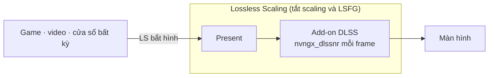

<div align="center">

# dlss5-anywhere

**DLSS 5 Neural Rendering cho mọi game, video hay ứng dụng, thông qua Lossless Scaling.**

[English](README.md) · [Tiếng Việt](README.vi.md)

</div>

> **Version v0.0.7** · Sửa lỗi NR không chạy với bản add-on RHI đang cài hiện nay ([#1](https://github.com/Won-Cafe/dlss5-anywhere/issues/1)). Các bản add-on mới đã đổi tên khóa hook vào LS, và khóa mới mặc định là Off. Đã cài từ trước? Đóng LS rồi **chạy script một lần** (chỉ `-Launch` cũng được): script ghi khóa mới và xóa các khóa cũ. `-GlobalTone` đã bị bỏ vì add-on không còn thiết lập đó.
>
> Đã chạy thử ngày 24/09/2026 trên RTX 5070 Ti với Lossless Scaling 3.2.2, RHI 2.7.5, ReShade 6.8.0, add-on v0.2026.922.310, NR DLL 310.8.2, driver NVIDIA 616.92.

Cài add-on DLSS 5 Neural Rendering (NR) một lần vào **Lossless Scaling** (LS), thay vì vào từng game. LS bắt hình cửa sổ nào thì cửa sổ đó có NR. Không đụng tới file game.

---

## Demo

Ảnh chia đôi: nửa trái bật NR, nửa phải tắt NR. Ảnh toàn khung: bật NR.

**Trailer YouTube trong trình duyệt.** Xem DLSS 5 trước cả khi game ra mắt.


**Game Wii qua Dolphin.** Vẫn còn chờ bản remaster?


**Game mobile qua Google Play Games.**


**Game PC chưa từng có DLSS.**


**Elden Ring max settings**, rồi NR toàn khung ở 4K.


**Black Myth: Wukong, max settings, 4K, NR toàn khung.**


NR hiệu quả nhất với nguồn có texture thấp. Với hình vốn đã sắc nét, khác biệt nhỏ hơn.

---

## Cài đặt

Bạn cần **NVIDIA RTX 20 trở lên** với driver 616.64 trở lên ([chi tiết](#gpu-nào-chạy-được)), **[Lossless Scaling](https://store.steampowered.com/app/993090/)** trên Steam, và **[RHI](https://github.com/RankFTW/RHI/releases)**, công cụ cài ReShade và các file DLSS thay cho bạn.

Có bốn bước, mỗi bước kết thúc bằng một dòng **Kiểm**, và bước 2 không bắt buộc. Lý do của từng bước nằm ở [Giải thích](#giải-thích).

### 1. RHI

Mở RHI và tìm thẻ **Lossless Scaling**. Nếu chưa thấy, dùng *Browse* để thêm thư mục LS. Rồi làm lần lượt:

1. **Components** → *ReShade* → **Install**
2. **Neural Rendering** → *Method* → **DLSS Tool (ShortFuse)**. Để *SF Version* và *NR DLL Version* ở **Latest**, *NR Cost Scaler* **Off** ([vì sao](#nr-cost-scaler)).
3. Bánh răng cạnh **Remove** → **ShortFuse Settings** → *Auto-configure ReShade for FrameGen* **Off** → **Save** ([vì sao](#auto-configure-reshade-for-framegen))
4. **Neural Rendering** → **Install**

Khoan mở LS. Script sẽ mở LS ở bước 4.


**Kiểm:** RHI hiện `✓ ReShade ✓ DLSS Tool (ShortFuse) ✓ DLSS SR ✓ DLSS RR ✓ DLSS FG ✓ NR DLL ✗ ASI Loader`. Thư mục LS có `dxgi.dll`, `ReShade.ini`, `renodx-dlss.addon64` và `nvngx_dlssnr.dll`.

### 2. LosslessProxy + LSP-Windowed (chỉ khi cần bắt cửa sổ)

Bỏ qua bước này với game fullscreen, vì LS tự bắt được. Hai add-on không chính thức này giúp LS bắt một *cửa sổ*: trình duyệt, giả lập, app chơi game mobile và game chạy cửa sổ ([chi tiết](#losslessproxy-và-lsp-windowed)). Đóng LS trước.

1. [LosslessProxy](https://github.com/FrankBarretta/LosslessProxy/releases): trong thư mục LS, đổi tên `Lossless.dll` thành `Lossless_original.dll`, rồi chép `Lossless.dll` vừa tải vào.
2. [LSP-Windowed](https://github.com/FrankBarretta/LSP-Windowed/releases): giải nén `LSP-Windowed.zip` vào `addons\LSP-Windowed\` trong thư mục LS.

**Kiểm:** file `LosslessProxy.log` trong thư mục LS có dòng `Loaded addon 'Windowed Mode'`.

### 3. Lấy repo

Chạy `git clone https://github.com/Won-Cafe/dlss5-anywhere`, hoặc bấm **Code › Download ZIP** rồi giải nén ở đâu cũng được.

### 4. Chạy script

Mở PowerShell tại thư mục repo (trong Explorer: chuột phải thư mục → *Open in Terminal*) rồi chạy:

```powershell
.\scripts\nr-config.ps1
```


Script hiện thiết lập hiện tại, hỏi vài câu, ghi `ReShade.ini`, rồi hỏi có mở LS không. Bấm Enter để giữ giá trị trong ngoặc. Các khóa LS luôn cần được ghi mà không hỏi.

Khi có tham số, script không hỏi gì. Thêm `-Launch` để mở LS sau khi ghi.

| Tham số | Tác dụng |
|---|---|
| `-On` / `-Off` | Bật hoặc tắt add-on NR. |
| `-Model Default\|Natural\|Cinematic` | Kiểu NR. A, B, C vẫn dùng được. |
| `-PassCount n` | Số pass NR mỗi frame, 1 đến 10. |
| `-Scale n` | Độ phân giải model chạy, tính theo phần trăm khung hình. Càng thấp càng nhanh; 100 = như gốc. Đây là nút chỉnh FPS. |
| `-Intensity x` | Độ mạnh hiệu ứng, 0 đến 1. |
| `-AutoMask 0\|1` | Tắt hoặc bật mặt nạ nhân vật. |
| `-LocalTone x` `-LocalStructure x` `-SkinStructure x` | Độ mạnh tone và chi tiết, 0 đến 1. |
| `-UiCorrection` `-Encoding` `-WhiteNits` `-WhiteOverride` | Các khóa HDR và giao diện. 0 = auto. |
| `-Fps on\|off` | Bộ đếm FPS của ReShade. |
| `-Ota on\|off` | Bước driver kiểm tra model qua mạng, áp dụng cho cả máy. Hỏi quyền admin. |
| `-Show` | In thiết lập hiện tại, không ghi gì. |
| `-Launch` | Mở LS với hardware acceleration của WPF tắt. |
| `-LsPath "…"` | Thư mục LS, khi script không tự tìm được. |

**Kiểm:** `-Show` không có cảnh báo, không có `(missing)` và không có `<- LS needs`. LS mở lên chưa scale và GPU gần như không tải. Bấm **Scale** (`Ctrl+Alt+S`): hình thay đổi, và `ReShade.log` có dòng `DLSS-NR direct: attached snippet`.

<details>
<summary>Không dùng RHI</summary>

1. Cài bản **with full add-on support** của [ReShade](https://reshade.me) vào `LosslessScaling.exe`, chọn API **Direct3D 10/11/12** và không chọn gói hiệu ứng nào.
2. Chép `renodx-dlss.addon64` và `nvngx_dlssnr.dll` đúng đời GPU từ [Discord RenoDX](https://discord.com/channels/1408098019194310818/1543975158937821315) vào thư mục LS. Chỉ giữ một file `renodx-dlss*.addon64`.
3. Làm tiếp bước 2, 3 và 4.

</details>

---

## Cách dùng

- **Mở LS** bằng `.\scripts\nr-config.ps1 -Launch`, không mở từ Steam ([vì sao](#khoá-disablehwacceleration)). Target cho shortcut một click: `powershell -ExecutionPolicy Bypass -File "<repo>\scripts\nr-config.ps1" -Launch`.
- **So sánh trước và sau:** bật tắt Scale, hoặc chạy `-Off -Launch` rồi `-On -Launch`.
- **Chỉnh:** đóng LS, chạy script, mở LS lại. Điểm khởi đầu tốt là Cinematic, 1 pass, Intensity 0.6–0.7, Scale 75.
- **Cập nhật:** trong RHI, **Reinstall** các hàng có bản mới. Sau đó chạy script một lần, vì bản add-on mới có thể đổi tên khóa.
- **Gỡ:** trong RHI, **Remove** ở Neural Rendering rồi **✕** ở ReShade. Trong thư mục LS, xóa `Lossless.dll` proxy, đổi tên `Lossless_original.dll` lại như cũ, và xóa `addons\LSP-Windowed`.

**Thiết lập LS.** Chọn profile trong LS và chỉnh theo ảnh.


| Mục | Thiết lập |
|---|---|
| Frame Generation | Type **Off** ([vì sao](#frame-generation-của-ls)) |
| Scaling | Type **Off**, để LS chỉ bắt hình và present. Chỉ bật khi bạn muốn LS upscale luôn. |
| Capture | API **WGC**, Queue target **1** |
| Rendering | Sync mode **Default**, Max frame latency **3**, bật HDR support, bật G-Sync, tắt Draw FPS |
| GPU & Display | Preferred GPU **Auto**, hoặc chọn card NVIDIA nếu máy có nhiều card. Output display: màn hình bạn chơi |

---

## Vấn đề đã biết

- **LS có thể treo cả màn hình khi dừng scale.** Unscale, hoặc LS tự dừng vì game mất focus, sẽ hủy swapchain của LS trong khi add-on vẫn còn dùng nó. Việc này có thể làm LS đóng, hoặc gây lỗi GPU phải reset máy. Lỗi nằm ở add-on và đã được báo. Để tránh: scale một lần cho cả phiên, giữ game ở phía trước, và thoát game trước khi đóng LS.
- **NR tốn thời gian ở từng frame output.** Hai pass tốn gấp đôi, và 4K tốn khoảng bốn lần 1080p: khoảng 20 ms mỗi pass ở 4K trên RTX 5070 Ti. `-Scale` giúp kéo con số đó xuống.
- **Lần Scale đầu có thể mất một phút** vì driver hỏi máy chủ NVIDIA về model. Cách xử lý: `-Ota off`.
- **Thao tác trong RHI có thể làm mất thiết lập.** *Auto-configure ReShade for FrameGen* có thể bật lại, và bản add-on mới có thể đổi tên khóa. Sau mỗi thao tác trong RHI, hãy chạy lại script.

---

## Lỗi thường gặp

| Triệu chứng | Cách xử lý |
|---|---|
| Bấm `Ctrl+Alt+S` mà không có gì đổi | Chờ vài giây sau lần scale đầu. Nếu mất từ một phút trở lên: `-Ota off`. |
| Scale chạy nhưng không có NR | Đóng LS, chạy script (Enter hết), rồi chạy `-Show`. `ReShade.log` phải mở đầu bằng *loaded from … dxgi.dll* và có dòng `DLSS-NR direct: attached snippet` sau khi scale. `-Fps on` cho biết ReShade có vẽ hay không. |
| `ReShade.log` cảnh báo *sl.interposer.dll not loaded* hoặc *hooks not ready* | Vô hại trong LS. Đó là nhánh Streamline của add-on, LS không dùng tới. |
| Dòng 1 của `ReShade.log` ghi *Reshade64.asi* | RHI đã cài ReShade sau một ASI loader, mà trong LS loader này chỉ chạy lúc thoát. Trong RHI: bánh răng → **ShortFuse Settings** → *Auto-configure ReShade for FrameGen* **Off** → **Save** → **Reinstall**. |
| LS crash khi mở, hoặc chính cửa sổ LS bị NR | LS đã được mở mà không qua script. Đóng LS rồi mở lại bằng `-Launch`. |
| Defender báo `RHI\downloads\…\shaders_DLSS5Feeder.zip` | RHI tự tải gói đó. Setup này không dùng tới nó. |
| PowerShell báo *running scripts is disabled* hoặc *not digitally signed* | Chạy `powershell -ExecutionPolicy Bypass -File .\scripts\nr-config.ps1`. Nếu bạn tải bản ZIP: chuột phải script → Properties → **Unblock**. |
| FPS thấp | Thử `-Scale 75` rồi thấp hơn nữa, với một pass. Sau đó hạ độ phân giải output trong LS. |

Vẫn chưa được? Mở issue kèm `ReShade.log`, GPU và driver, phiên bản LS, và **Copy Report** của RHI.

---

## Giải thích

### Cách chạy

LS bắt một cửa sổ và present qua swapchain riêng của nó, chặng cuối trước khi hình lên màn hình. Add-on hook vào bước Present đó, nên mọi frame LS hiển thị đều đi qua NR. Game có NR gốc đưa cho model màu, motion vector và depth. LS chỉ có màu, nên model chạy mỗi frame present một lần, ở độ phân giải output, với motion và depth giả. Cảnh tĩnh đẹp nhất; chuyển động nhanh có thể nhấp nháy.



### Vì sao có từng bước

#### GPU nào chạy được

NVIDIA hỗ trợ NR trên RTX 50. RTX 20–40 chạy runtime NR do cộng đồng patch, và driver mới có thể làm hỏng nó. Cộng đồng cũng đã chạy được trên AMD, nhưng ở đây chưa thử. Repo không kèm DLL nào: RHI tải chúng từ nguồn gốc.

#### Add-on DLSS Tool (ShortFuse)

Add-on ReShade `renodx-dlss` của ShortFuse, chia sẻ trên [Discord RenoDX](https://discord.com/channels/1408098019194310818/1543975158937821315) và cập nhật thường xuyên. RHI cài add-on nhưng không ghi các khóa NR, và mặc định của add-on được làm cho game có DLSS gốc. Mỗi lần chạy, script ghi:

- `DirectNeuralRenderingHookStage=3`: chạy ở *Present*, bước duy nhất LS có. Mặc định là Off, nên thiếu khóa này thì NR không bao giờ chạy.
- `DirectNeuralRenderingReuseDlssUpscalingResources=0`: không chờ motion vector và depth của DLSS, vì LS không có.
- `RequireDlss=0` và `HookMethod=2`: cùng các thiết lập đó, dưới tên mà các bản cũ đọc. Mỗi bản bỏ qua những khóa nó không biết.

#### Auto-configure ReShade for FrameGen

Tùy chọn này dành cho game có DLSS Frame Generation. Nó đổi tên ReShade thành `Reshade64.asi` và đặt sau một ASI loader. Trong LS, loader đó chỉ chạy lúc thoát, nên lúc bạn scale thì ReShade chưa được nạp.

#### NR Cost Scaler

Để **tắt**. [DLSSNR-Cost-Scaler](https://github.com/xenmods/DLSSNR-Cost-Scaler) của xenmods từng giúp NR đủ nhẹ để dùng bằng cách chạy model ở độ phân giải thấp hơn. Giờ add-on tự làm việc này (`-Scale`), nên thêm một bộ scaler nữa chỉ làm cùng một khung hình bị co giãn hai lần. Nếu trước đây bạn có bật, hãy chuyển nó về **Off** trong RHI rồi **Reinstall** Neural Rendering.

#### LosslessProxy và LSP-Windowed

LS gốc chỉ bắt được game fullscreen. `Lossless.dll` proxy và add-on Windowed Mode của FrankBarretta giúp LS bắt được trình duyệt, game chạy cửa sổ và giả lập. Hai add-on này không chính thức, và tác giả lưu ý chúng có thể vi phạm điều khoản của LS.

#### Khoá DisableHWAcceleration

Cửa sổ của chính LS được vẽ bằng WPF qua D3D, nên NR cũng sẽ xử lý luôn cửa sổ thiết lập. Windows không có công tắc riêng cho từng app. Vì vậy trong lúc LS chạy, script bật `HKCU\SOFTWARE\Microsoft\Avalon.Graphics\DisableHWAcceleration`, rồi trả lại như cũ khi LS thoát. Một dấu đánh dấu giúp lần chạy sau dọn dẹp nếu lần trước bị ngắt giữa chừng. Mở LS từ Steam sẽ bỏ qua toàn bộ bước này.

#### Frame Generation của LS

Để tắt. NR chạy trên mọi frame LS xuất ra, kể cả frame nội suy. Vì vậy frame generation nhân khối lượng NR lên thay vì thêm frame rẻ, và frame nội suy còn có thể bị méo hình rõ rệt.

### Giới hạn

- Không có motion vector và depth, nên chuyển động nhanh bị nhấp nháy và rung gợn.
- Chi phí tăng theo độ phân giải output. Với tích hợp gốc trên RTX 50, NVIDIA nêu mức hao 50–60 % FPS.
- NR xử lý mọi thứ trên màn hình, kể cả HUD và phụ đề.
- Chỉ dùng cho game chơi đơn. Game có anti-cheat theo luật riêng của game đó; RHI cũng có cảnh báo.
- Add-on và runtime là bản cộng đồng, phân phối ngoài GitHub, và thay đổi thường xuyên.

### Pháp lý

- Repo chỉ chứa tài liệu và script. Repo không phân phối DLL nào của NVIDIA, ReShade, add-on hay Lossless Scaling.
- DLSS, GeForce và RTX là nhãn hiệu của NVIDIA. Lossless Scaling thuộc THS, ReShade thuộc crosire, RenoDX thuộc ShortFuse, RHI thuộc RankFTW, DLSSNR-Cost-Scaler thuộc xenmods, LosslessProxy và LSP-Windowed thuộc FrankBarretta. Không bên nào trong số này liên quan tới hay xác nhận repo này.
- Bạn tự chịu rủi ro khi dùng, không có bảo hành. Mã nguồn theo giấy phép MIT, xem [LICENSE](LICENSE).

---

## Ghi công

Repo này dựa trên công sức của nhiều người khác. Nếu định tặng sao, hãy tặng họ trước.

- [ReShade](https://github.com/crosire/reshade?ref=dlss5-anywhere) · crosire
- [RenoDX](https://github.com/clshortfuse/renodx?ref=dlss5-anywhere) · ShortFuse, add-on [`renodx-dlss`](https://discord.com/channels/1408098019194310818/1543975158937821315)
- [RHI](https://github.com/RankFTW/RHI?ref=dlss5-anywhere) · RankFTW
- [DLSSNR-Cost-Scaler](https://github.com/xenmods/DLSSNR-Cost-Scaler?ref=dlss5-anywhere) · xenmods
- [LosslessProxy](https://github.com/FrankBarretta/LosslessProxy?ref=dlss5-anywhere) và [LSP-Windowed](https://github.com/FrankBarretta/LSP-Windowed?ref=dlss5-anywhere) · FrankBarretta
- [Lossless Scaling](https://store.steampowered.com/app/993090/?ref=dlss5-anywhere) · THS, trên Steam
- [speedlemur](https://github.com/speedlemur?ref=dlss5-anywhere) (người làm bản NR DLSS 5 chạy được đầu tiên) · lecram, Krish · HunterXHK, người chỉ ra các khóa mới ở [#1](https://github.com/Won-Cafe/dlss5-anywhere/issues/1) · NVIDIA · và [Discord RenoDX](https://discord.com/channels/1408098019194310818/1543975158937821315), nơi phần lớn những thứ này được mày mò công khai

---

## Dự án khác của tôi

**[W.O.N](https://github.com/Won-Cafe/W.O.N)** · The Way of Intentional Flow

Bạn biết mình muốn gì, nhưng khoảng trống từ ý định đến thực tại vẫn còn đó. W.O.N chia bài toán thành ba trụ: **What** là thực tại bạn đang đứng, **Own** là cái thuộc về bạn, **Need** là phương tiện bạn cần. Rồi nó giữ cho dòng giữa ba trụ tiếp tục chảy, với các đệ, những trợ thủ AI mỗi đệ một nghề, đi cùng bạn.

Chính các đệ đó đã cùng tôi dựng dlss5-anywhere, từ dò tài liệu, viết script đến soạn trang này.
