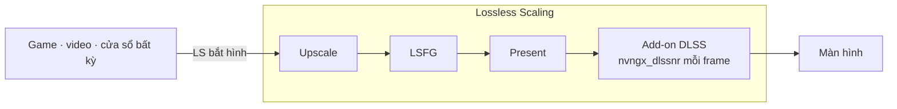

<div align="center">

# dlss5-anywhere

**DLSS 5 Neural Rendering cho mọi game, video hay app, qua Lossless Scaling.**

[English](README.md) · [Tiếng Việt](README.vi.md)

</div>

> **Version v0.0.2** · bản thử nghiệm tính đa dụng, cải thiện nhẹ FPS.
>
> Đã chạy thử ngày 07/09/2026 trên RTX 5070 Ti với Lossless Scaling 3.2.2, RHI 2.6.3, ReShade 6.8.0, DLSS SR/RR/FG 310.9.0, NR DLL 310.8.2, driver NVIDIA 616.64.

Ý tưởng rất đơn giản: thay vì cài add-on DLSS 5 Neural Rendering (gọi tắt là NR) vào từng game, ta cài nó vào **Lossless Scaling** (gọi tắt là LS). LS bắt được hình của cửa sổ nào thì hình đó sẽ được NR xử lý. Không cần chỉnh sửa file của game.

---

## Demo

Ảnh chia đôi là cùng một khung hình để so sánh: nửa trái bật NR, nửa phải tắt NR. Ảnh toàn khung là NR bật.

**Video YouTube trong trình duyệt**

*Xem trailer với NR bật. Trải nghiệm DLSS 5 trước cả khi game ra mắt thì sao?*


**Game Wii qua Dolphin**

*Game cũ trên giả lập. Còn cần chờ bản remastered nữa không?*


Cùng cảnh đó, NR bật trên toàn khung hình.


**Game mobile qua Google Play Games**

*Tựa game mobile quen thuộc, chạy với công nghệ hình ảnh mới nhất của PC.*


**Game PC không có DLSS**

*Game chưa từng hỗ trợ DLSS. Giờ vẫn có NR.*


**Game PC hiện đại, max settings**

*Đã max settings rồi. NR còn thêm được gì nữa?*


Cùng cảnh đó, NR bật trên toàn khung hình, độ phân giải 4K.


**Black Myth: Wukong, max settings, 4K**

*Một trong những game đẹp nhất hiện nay. NR bật toàn khung.*


Hiệu quả của NR rõ nhất ở nguồn có texture thấp. Với hình vốn đã sắc nét, khác biệt nhỏ hơn.

---

## Cài đặt

Phần này chỉ có thao tác. Vì sao làm như vậy: xem [Giải thích](#giải-thích).

Cần có:

- **Card NVIDIA RTX 20 trở lên**, driver 616.64 trở lên ([chi tiết](#gpu-nào-chạy-được))
- **[Lossless Scaling](https://store.steampowered.com/app/993090/)** trên Steam
- **[RHI](https://github.com/RankFTW/RHI/releases)**

Bốn bước. Cuối mỗi bước có một dòng **Kiểm**.

### 1. RHI

Mở RHI, tìm thẻ **Lossless Scaling**. Không thấy thì bấm *Browse* và trỏ tới thư mục cài LS. Rồi làm lần lượt:

1. **Components** → *ReShade* → **Install**
2. **Neural Rendering** → *Method* chọn **DLSS Tool (ShortFuse)** ([về add-on này](#add-on-dlss-tool-shortfuse))
3. Bấm nút bánh răng cạnh **Remove** → **ShortFuse Settings** → gạt *Auto-configure ReShade for FrameGen* sang **Off** → **Save** ([vì sao](#auto-configure-reshade-for-framegen))
4. **Neural Rendering** → **Install**
5. Gạt **NR Cost Scaler** sang **On** ([vì sao](#nr-cost-scaler))
6. **Launch** một lần, rồi đóng LS


**Kiểm:** dòng trạng thái trong RHI hiện `✓ ReShade ✓ DLSS Tool (ShortFuse) ✓ DLSS SR ✓ DLSS RR ✓ DLSS FG ✓ NR DLL ✗ ASI Loader`, hàng NR Cost Scaler ghi *Installed*. Thư mục LS có file `ReShade.log`, dòng đầu là *Initializing crosire's ReShade*.

### 2. LosslessProxy + LSP-Windowed

Hai add-on không chính thức, có thể vi phạm điều khoản của LS ([chi tiết](#losslessproxy-và-lsp-windowed)). Chỉ tải từ hai trang release dưới. Đóng LS trước.

1. Tải `Lossless.dll` từ [release LosslessProxy](https://github.com/FrankBarretta/LosslessProxy/releases). Trong thư mục LS, đổi tên `Lossless.dll` gốc thành `Lossless_original.dll`, chép file mới vào.
2. Tải `LSP-Windowed.zip` từ [release LSP-Windowed](https://github.com/FrankBarretta/LSP-Windowed/releases), giải nén vào `addons\LSP-Windowed\` trong thư mục LS.

**Kiểm:** thư mục LS có file `LosslessProxy.log` với dòng `Loaded addon 'Windowed Mode'`.

### 3. Lấy repo

```
git clone https://github.com/Won-Cafe/dlss5-anywhere
```

Hoặc **Code › Download ZIP** trên GitHub rồi giải nén. Để đâu cũng được.

### 4. Chạy script

Đóng LS. Mở PowerShell trong thư mục repo:

```powershell
.\scripts\nr-config.ps1
```

Script hỏi lần lượt: bật hay tắt NR, **Model**, **PassCount**, **HookPoint**, **Cost Scaler** (bật tắt và tỉ lệ), bộ đếm FPS. Enter là giữ giá trị hiện tại. Rồi hỏi có vào phần nâng cao không, rồi hỏi mở LS.


Có tham số thì script không hỏi, ghi thẳng. Thêm `-Launch` để mở LS ngay sau khi ghi.

| Tham số | Tác dụng |
|---|---|
| `-On` / `-Off` | Bật hoặc tắt add-on NR. |
| `-Model A\|B\|C` | Chọn model NR. |
| `-PassCount n` | Số lần NR chạy trên mỗi frame. |
| `-HookPoint n` | Vị trí add-on móc vào chuỗi xử lý hình. |
| `-CostScaler on\|off` | Bật hoặc tắt NR Cost Scaler. |
| `-CostScale x` | Tỉ lệ độ phân giải nội bộ của Cost Scaler, 0.25 đến 1.00. |
| `-Intensity x` | Độ mạnh của hiệu ứng NR. |
| `-AutoMask 0\|1` | Bật hoặc tắt mặt nạ tự động. |
| `-GlobalTone x` `-LocalTone x` | Độ mạnh tone toàn khung và tone cục bộ. |
| `-LocalStructure x` `-SkinStructure x` | Độ mạnh vân bề mặt và vân da người. |
| `-UiCorrection` `-Encoding` `-WhiteNits` `-WhiteOverride` | Thiết lập HDR và giao diện. |
| `-Fps on\|off` | Hiện hoặc ẩn bộ đếm FPS và frame time của ReShade. |
| `-Ota on\|off` | Bật hoặc tắt việc driver NVIDIA kiểm tra model DLSS mới qua mạng (NGX OTA), áp dụng toàn máy. Cần quyền Admin. Không cần đóng LS. |
| `-Show` | Xem cấu hình hiện tại, không ghi. |
| `-Launch` | Mở LS, tắt hardware acceleration của WPF trong lúc LS chạy. |
| `-LsPath "…"` | Đường dẫn thư mục LS, khi script không tự tìm thấy. |

**Kiểm:** LS mở lên, chưa scale, mức dùng GPU trong Task Manager gần 0. Bấm **Scale** (`Ctrl+Alt+S`), hình đổi khác. `ReShade.log` có dòng báo NR khởi tạo thành công.

<details>
<summary>Không dùng RHI</summary>

1. Cài [ReShade](https://reshade.me) bản **with full add-on support** vào `LosslessScaling.exe`, API **Direct3D 10/11/12**, bỏ chọn mọi gói effect.
2. Chép `renodx-dlss.addon64` và `nvngx_dlssnr.dll` đúng đời GPU (lấy từ [kênh Discord RenoDX](https://discord.com/channels/1408098019194310818/1543975158937821315)) vào thư mục LS. Chỉ để một file `renodx-dlss*.addon64`.
3. Mở LS một lần rồi đóng. Làm tiếp bước 2, 3 và 4.

</details>

---

## Cách dùng

- **Mở LS:** `.\scripts\nr-config.ps1 -Launch` ([vì sao không mở từ Steam](#khoá-disablehwacceleration)). Muốn một cú bấm: tạo shortcut với target `powershell -ExecutionPolicy Bypass -File "<thư mục repo>\scripts\nr-config.ps1" -Launch`.
- **So sánh trước sau:** bật rồi tắt Scale. Hoặc `-Off -Launch` rồi `-On -Launch`.
- **Chỉnh:** đóng LS, chạy script, mở LS lại. Nên bắt đầu Model C, Intensity 0.6–0.7. Muốn thêm FPS: bật Cost Scaler, hạ `-CostScale`.
- **Phím tắt Cost Scaler** khi đang scale: `Ctrl+Alt+Space` bật tắt, `Ctrl+Alt+PgUp` / `Ctrl+Alt+PgDn` tăng giảm tỉ lệ, `Ctrl+Alt+End` đổi thuật toán dựng hình.
- **Cập nhật:** RHI → **Reinstall** ở hàng có bản mới, rồi chạy script lại.
- **Gỡ:** RHI → gạt **NR Cost Scaler** Off → nút **Remove** đỏ ở hàng Neural Rendering → nút **✕** đỏ ở hàng ReShade. Trong thư mục LS: xoá `Lossless.dll` của proxy, đổi tên `Lossless_original.dll` về `Lossless.dll`, xoá thư mục `addons\LSP-Windowed`.

**Thiết lập LS**

Cấu hình đã chạy tốt khi thử nghiệm. Mở LS, vào profile đang dùng, chỉnh theo ảnh.


| Mục | Thiết lập |
|---|---|
| Frame Generation | LSFG 3.1, Mode **Adaptive**, Target **60**, Flow scale tối đa, Performance tắt ([giới hạn](#frame-generation-của-ls)) |
| Scaling | Type **FSR**, Mode **Auto**, Sharpness giữa, Optimized version tắt |
| Capture | Capture API **WGC**, Queue target **1** |
| Rendering | Sync mode **Off (Allow tearing)**, Max frame latency **3**, HDR support bật |
| GPU & Display | Preferred GPU **Auto**; nhiều GPU thì chọn thẳng GPU NVIDIA. Output display chọn đúng màn hình và độ phân giải muốn xuất |

---

## Lỗi thường gặp

| Triệu chứng | Cách xử lý |
|---|---|
| Bấm `Ctrl+Alt+S` mà chưa thấy gì thay đổi | Chờ một lúc. ReShade và add-on NR cần thời gian khởi động sau lần scale đầu. Nếu chờ từ một phút trở lên, chạy `-Ota off`. |
| LS vừa mở lên đã bị ReShade xử lý, kể cả cửa sổ thiết lập | LS được mở không qua script. Kiểm bằng `reg query "HKCU\SOFTWARE\Microsoft\Avalon.Graphics"`, phải thấy `DisableHWAcceleration 0x1`. Đóng LS, mở lại bằng `.\scripts\nr-config.ps1 -Launch`. |
| PowerShell báo `running scripts is disabled on this system` hoặc `not digitally signed` | Chạy bằng `powershell -ExecutionPolicy Bypass -File .\scripts\nr-config.ps1`. Nếu tải repo dạng ZIP: chuột phải `nr-config.ps1` → Properties → tick **Unblock**. |
| FPS tụt | Bật NR Cost Scaler, hạ tỉ lệ, ví dụ `-CostScale 0.67`. Kiểm Frame Generation và Scaling của LS đang bật như bảng Thiết lập LS. Vẫn thấp thì hạ độ phân giải ra. |

Nếu vẫn kẹt, mở issue kèm `ReShade.log`, GPU và driver, phiên bản LS, và **Copy Report** từ RHI.

---

## Giải thích

### Cách chạy

- LS bắt hình của mọi thứ trên màn hình và kiểm soát swapchain, bước cuối cùng trước khi hình ra màn. Đặt add-on ở đó là đủ để áp NR cho mọi nguồn.
- Khi NR được tích hợp sẵn trong game, model nhận cả màu, motion vector và depth. Trong LS chỉ có màu, nên add-on chạy ở chế độ *Present*: xử lý một lần cho mỗi frame được trình chiếu. Kết quả đẹp ở cảnh chậm, dễ nháy ở cảnh chuyển động nhanh.
- NR chạy ở độ phân giải **đầu ra**, trên **mỗi frame trình chiếu**. Độ phân giải ra càng cao, NR càng nặng.



### Vì sao từng bước

#### GPU nào chạy được

RTX 50 được NVIDIA hỗ trợ chính thức. RTX 20–40 chạy qua runtime NR do cộng đồng chỉnh, driver mới có thể làm nó ngừng chạy. Card AMD: cộng đồng đã chạy được, repo này chưa thử. Repo không chứa file DLL nào; RHI tải chúng từ nguồn gốc.

#### Add-on DLSS Tool (ShortFuse)

Đây là add-on ReShade `renodx-dlss` của ShortFuse, phân phối qua [kênh Discord RenoDX](https://discord.com/channels/1408098019194310818/1543975158937821315), không phải GitHub, và đổi thường xuyên. RHI tải nó về và cài cùng ReShade, runtime NR. Script ở bước 4 ghi khoá `DirectNeuralRenderingRequireDlss=0` vào ReShade.ini để add-on chịu chạy trong một host không có DLSS như LS.

#### Auto-configure ReShade for FrameGen

Tuỳ chọn này dành cho game có DLSS Frame Generation: bật lên, RHI đổi tên ReShade thành `ReShade64.asi` và cài thêm ASI Loader vào thư mục LS. LS không có DLSS Frame Generation nên không cần, và thêm một lớp nạp nữa chỉ thêm chỗ hỏng.

#### NR Cost Scaler

[DLSSNR-Cost-Scaler](https://github.com/xenmods/DLSSNR-Cost-Scaler) của xenmods là một DLL proxy đứng giữa add-on và runtime NR. Nó cho model NR chạy ở độ phân giải nội bộ thấp hơn, rồi lấy hình gốc làm khung và chuyển phần chi tiết neural lên đó. FPS tăng đáng kể mà hình không bị mềm như phóng to thuần. Cấu hình nằm trong `nvngx_dlssnr.ini`; script chỉnh được bằng `-CostScaler` và `-CostScale`.

#### LosslessProxy và LSP-Windowed

LS gốc chỉ bắt được game toàn màn hình. Hai add-on của FrankBarretta thay `Lossless.dll` bằng một bản proxy và thêm chế độ cửa sổ, nhờ đó LS bắt được trình duyệt, game chạy windowed, emulator. Cả hai không chính thức; tác giả lưu ý chúng có thể vi phạm điều khoản sử dụng của LS. Không có chúng, các demo YouTube, Dolphin, Google Play ở trên không chạy được.

#### Khoá DisableHWAcceleration

Giao diện LS viết bằng WPF. WPF vẽ bằng D3D, nên nếu không tắt hardware acceleration của WPF thì cửa sổ thiết lập của LS cũng bị NR xử lý, và GPU bận ngay khi chưa scale. Windows không có khoá riêng cho từng app, nên script bật khoá `HKCU\SOFTWARE\Microsoft\Avalon.Graphics\DisableHWAcceleration` trong lúc LS chạy rồi trả lại như cũ khi LS tắt. Nó để lại một giá trị đánh dấu cạnh khoá; nếu lần trước không kịp trả, lần mở sau dọn theo dấu đó. Mở LS từ Steam hay RHI vẫn chạy, nhưng không có bước này.

#### Frame Generation của LS

NR chạy trên mỗi frame LS xuất ra, gồm cả frame nội suy, không phải trên frame của game. Frame Generation vì thế nhân khối lượng NR theo cùng hệ số, và chi phí NR mỗi lần Present đặt ra trần FPS đầu ra mà Frame Generation không vượt qua được. Nó vẫn giúp thêm một chút, nên bảng Thiết lập LS để bật.

### Giới hạn

- Không có motion vector và depth, nên hình có thể nhấp nháy hoặc rung gợn khi chuyển động nhanh.
- Chi phí tính theo độ phân giải đầu ra. NVIDIA cho biết tích hợp gốc trên RTX 50 mất 50–60 % FPS.
- Mọi thứ trên màn hình đều bị xử lý, kể cả HUD, phụ đề và giao diện.
- Chỉ dùng cho game chơi đơn. Với game có anti-cheat, bạn phải theo luật của game đó; RHI cũng cảnh báo điều này ngay chân cửa sổ.
- Add-on và runtime là bản cộng đồng, phân phối ngoài GitHub và đổi thường xuyên.

### Pháp lý

- Repo chỉ chứa tài liệu và script. Không phân phối DLL của NVIDIA, ReShade, add-on hay bất kỳ file nào của Lossless Scaling.
- DLSS, GeForce, RTX là nhãn hiệu của NVIDIA. Lossless Scaling thuộc THS. ReShade thuộc crosire. RenoDX thuộc ShortFuse. RHI thuộc RankFTW. DLSSNR-Cost-Scaler thuộc xenmods. LosslessProxy và LSP-Windowed thuộc FrankBarretta; tác giả lưu ý chúng có thể vi phạm điều khoản sử dụng của LS. Không bên nào trong số này liên quan hay xác nhận repo này.
- Bạn tự chịu rủi ro khi dùng. Không có bảo hành. Mã nguồn theo giấy phép MIT, xem [LICENSE](LICENSE).

---

## Ghi công

Repo này dựa trên công sức của nhiều người khác. Nếu định tặng sao, hãy tặng họ trước.

- [ReShade](https://github.com/crosire/reshade?ref=dlss5-anywhere) · crosire
- [RenoDX](https://github.com/clshortfuse/renodx?ref=dlss5-anywhere) · ShortFuse, add-on [`renodx-dlss`](https://discord.com/channels/1408098019194310818/1543975158937821315)
- [RHI](https://github.com/RankFTW/RHI?ref=dlss5-anywhere) · RankFTW
- [DLSSNR-Cost-Scaler](https://github.com/xenmods/DLSSNR-Cost-Scaler?ref=dlss5-anywhere) · xenmods
- [LosslessProxy](https://github.com/FrankBarretta/LosslessProxy?ref=dlss5-anywhere) và [LSP-Windowed](https://github.com/FrankBarretta/LSP-Windowed?ref=dlss5-anywhere) · FrankBarretta
- [Lossless Scaling](https://store.steampowered.com/app/993090/?ref=dlss5-anywhere) · THS, trên Steam
- [speedlemur](https://github.com/speedlemur?ref=dlss5-anywhere) (người làm bản NR DLSS 5 chạy được đầu tiên) · lecram, Krish · NVIDIA · và [Discord RenoDX](https://discord.com/channels/1408098019194310818/1543975158937821315), nơi phần lớn những thứ này được mày mò công khai

---

## Dự án khác của tôi

**[W.O.N](https://github.com/Won-Cafe/W.O.N)** · The Way of Intentional Flow

Bạn biết mình muốn gì, nhưng khoảng trống từ ý định đến thực tại vẫn còn đó. W.O.N chia bài toán thành ba trụ: **What** là thực tại bạn đang đứng, **Own** là cái thuộc về bạn, **Need** là phương tiện bạn cần. Rồi nó giữ cho dòng giữa ba trụ tiếp tục chảy, với các đệ, những trợ thủ AI mỗi đệ một nghề, đi cùng bạn.

Chính các đệ đó đã cùng tôi dựng dlss5-anywhere, từ dò tài liệu, viết script đến soạn trang này.
